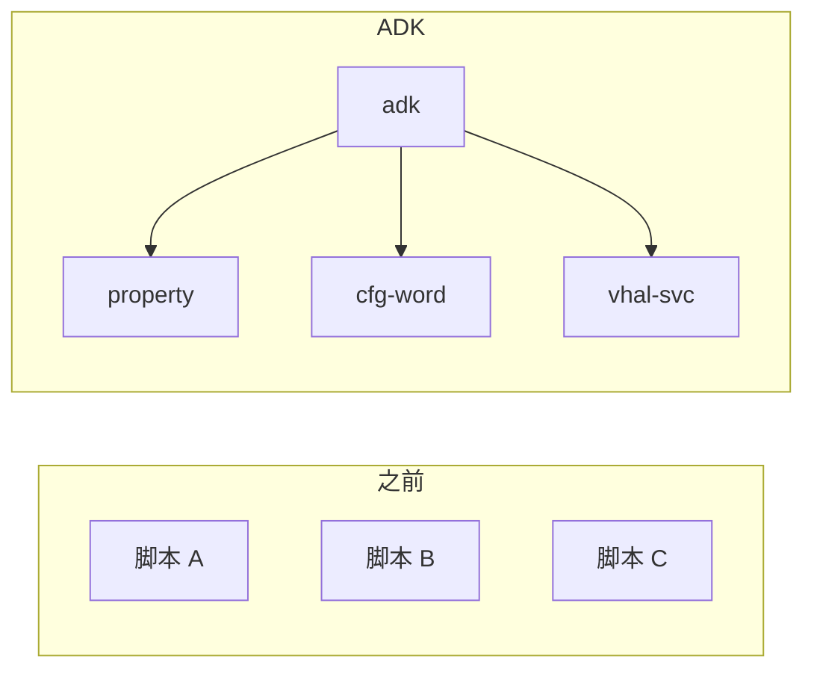
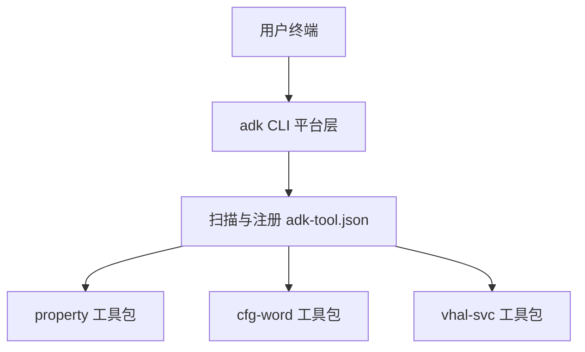
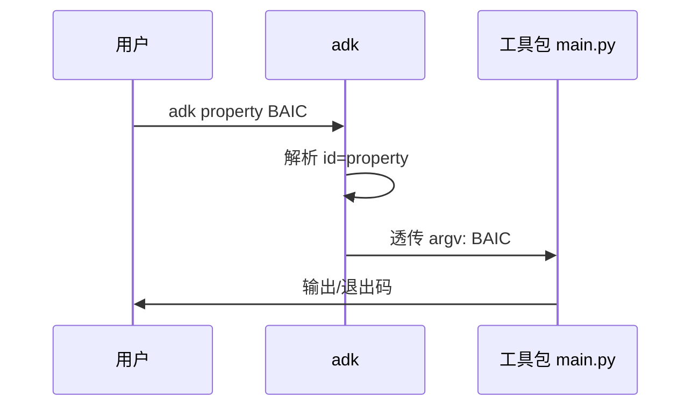
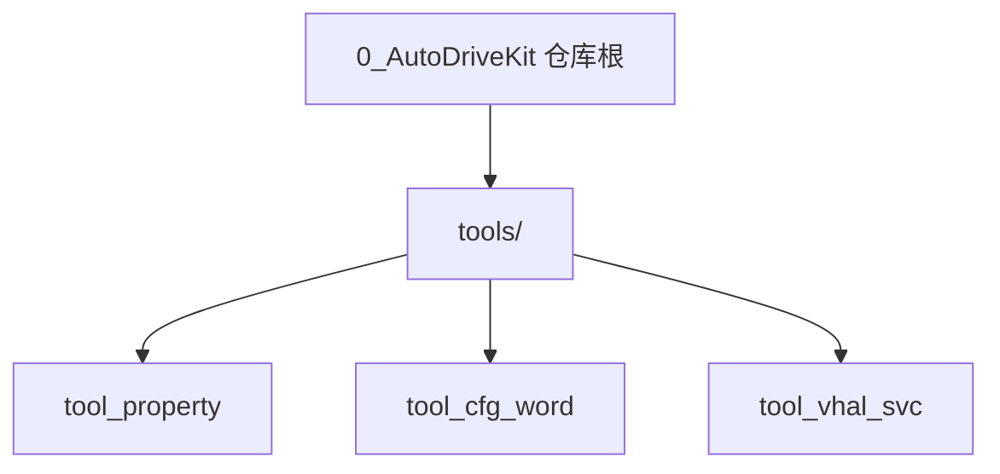

# ADK（AutoDriveKit）通用工具平台说明

> 本文档面向**使用者**与**需要接入新工具的协作者**，侧重平台统一入口、工作原理与协作约定。各工具的具体参数、配置项与流水线细节以各工具包目录下的 **README** 为准（见 [6. 已集成工具包一览](#6-已集成工具包一览)）。  
> **说明**：本文不涵盖仓库中 `todos/` 目录下的实验或历史内容。

---

## 0. 文档说明

### 0.1 文档目的与读者

| 读者 | 建议阅读重点 |
|------|----------------|
| 日常使用者 | 第 1、5、6、10 章 |
| 环境/集成维护者 | 第 4、8 章（第 4 章含**完整飞书自建应用与表格授权**步骤） |
| 希望接入新工具的开发者 | 第 7 章 + 根目录 [README.md](../README.md) 中「工具生态」约定 |

### 0.2 与仓库内其它文档的分工

| 文档 | 作用 |
|------|------|
| **本文** | **对外完整说明**：含 Python 环境、**pip 安装**、**飞书自建应用与环境变量**（第 4 章）、**用户配置 / 数据目录与 `adk update`（§4.5.5）**、CLI 与架构、版本与反馈、工具索引；读者**仅依赖本文**即可完成平台安装与飞书侧首配。 |
| [README.md](../README.md) | 仓库内入口：与本文第 4 章**并行维护**的安装与飞书配置、**4A / `adk update` 与发布脚本**详表、`adk -h` 结构、`adk-tool.json` 字段表、工具生态扩展约定。 |
| `tools/tool_*/README.md` | 各工具专述：命令、配置、飞书 API 权限明细、Git、安全校验等 |

### 0.3 图示与画板约定

- **Mermaid**：嵌入在 Markdown 中，便于在 Git 托管页、Cursor、VS Code 等环境直接预览。  
- **截图占位**：以「`<!-- 截图：... -->`」或文字说明标注建议文件名与截取要点，后续可替换为真实图片链接。  
- **飞书画板占位**：以「`[画板]`」标注标题；你方导入飞书后，可将该段替换为画板链接或嵌入说明。

---

## 1. 概述与价值主张

### 1.1 平台是什么

**AutoDriveKit**（简称 **ADK**）是**统一工具平台**：为车辆相关代码生成、配置同步等场景提供**单一命令行入口 `adk`**。每个能力以**独立工具包**形式放在 `tools/` 下固定目录中，通过清单 **`adk-tool.json`** 注册后，即可被 `adk` 发现并调用，实现「即插即用」式扩展。

### 1.2 解决什么问题

- **入口分散**：原先多个脚本、多套用法；统一为 `adk <工具包> …`，降低记忆成本。  
- **协作一致**：新工具遵循同一套注册与入口约定，便于评审与文档化。  
- **可选交互**：无参数时进入 Rich 交互菜单，适合不常记命令的同事；熟手可直接「一条龙」命令。

### 1.3 核心能力一览

| 能力 | 说明 |
|------|------|
| 工具发现 | 启动时扫描 `tools/*/adk-tool.json`，校验 `id` 唯一且入口文件存在 |
| 参数透传 | `adk <id>` 之后的参数原样交给工具包入口（默认 `main.py`） |
| 帮助与菜单 | `adk -h` 分区展示；仅 `adk` 时进入交互式工具选择与参数向导 |
| 版本查询 | `adk -v` / `adk --version` 与平台包版本一致 |

### 1.4 从「多脚本」到「统一入口」（示意）

**【图】场景对比**

- **Mermaid（可预览）**



- **画板占位**：`[画板] ADK 统一入口与多工具关系（产品向一页图）` — 后续可替换为飞书链接。

---

## 2. 术语与命名

### 2.1 术语表

| 术语 | 含义 |
|------|------|
| **ADK** | AutoDriveKit 平台简称 |
| **工具包** | `tools/` 下含 `adk-tool.json` 的一个子目录 |
| **`id`** | 工具在命令行中的注册名，如 `property`、`cfg-word`；与 `adk <id>` 一致 |
| **`ARGS`** | 写在工具包名之后的参数，由各工具自行解析 |
| **`adk-tool.json`** | 工具包根目录下的注册清单（UTF-8） |
| **`interactive_project_pick`** | 清单中可选配置：交互时从工具包内 `config.json` 读取项目列表供选择 |

### 2.2 `adk <id>` 与目录对应

| CLI `id` | 定位摘要 | 工具包目录 |
|----------|----------|------------|
| `property` | CarProperty 生成与导入（飞书/Excel/头文件/Git） | `tools/tool_property/` |
| `cfg-word` | 整车配置字映射表与维护部署；兼 carpropertylist 侧子表 | `tools/tool_cfg_word/` |
| `vhal-svc` | VHAL：fetch → generate → deploy → compile 强依赖链 | `tools/tool_vhal_svc/` |

目录名建议为 `tool_<领域短名>`，与已有工具风格一致。

---

## 3. 工作原理与架构（用户向）

### 3.1 工作原理（文字）

1. 你在含 **`pyproject.toml`** 的仓库根安装平台后，终端中的 **`adk`** 由平台包入口脚本启动。  
2. 平台扫描 **`tools/`** 下各子目录，读取 **`adk-tool.json`**，构建工具列表（排序、简介、交互提示等）。  
3. 若你输入 **`adk <id> …`**，平台将 **`<id>` 之后** 的所有参数**不做改写**，交给该工具包配置的入口脚本（默认 **`main.py`**），效果等价于在该工具目录执行 `python3 main.py …`。  
4. 若你只输入 **`adk`**，则进入 **交互菜单**：先选工具包；若清单配置了 **`interactive_project_pick`**，再选项目；最后可回车执行默认流水线或输入与 `main.py` 一致的参数片段。

### 3.2 逻辑架构



**画板占位**：`[画板] ADK 逻辑架构（可加图标/品牌色）`

### 3.3 一次命令从输入到执行（序列示意）



**画板占位**：`[画板] 交互菜单三步流程（选工具 → 选项目 → 参数）`

### 3.4 本文不展开的部分

各工具内部的 **fetch / generate / deploy** 等步骤、飞书字段与 Git 路径等，均以对应 **`tools/tool_*/README.md`** 为准；本文只说明它们如何被 **`adk`** 调用。

---

## 4. 环境与安装

### 4.1 环境要求

- **Python 3.10+**  
- 建议使用 **`python3 -m pip`**，避免系统 `pip` 指向旧版 Python。

### 4.2 安装步骤

在**本仓库根目录**（含 `pyproject.toml`）执行：

```bash
python3 -m pip install -U pip setuptools wheel
python3 -m pip install -e .
```

也可使用：

```bash
python3 -m pip install -r requirements.txt
```

通用依赖由平台 **`pyproject.toml`** 统一声明（如 Typer、Rich、openpyxl 等）。

### 4.3 缺少 Typer 时的行为

若未安装平台包或当前环境缺少 **Typer**，直接运行 `python3 -m autodrivekit` 或已安装的 `adk` 时，平台会**打印原因与推荐安装命令**，并可询问是否对仓库根执行 **`pip install -e .`**；选择确认后会尝试安装并在成功后**用相同参数重新启动**。

### 4.4 PATH 与「命令未找到」

若 shell 提示 **`adk` 未找到**，说明尚未安装入口脚本或未加入 **`PATH`**。请先在仓库根完成 **`pip install -e .`**；该情况由操作系统处理，应用层无法在运行前拦截。

### 4.5 飞书自建应用与环境变量（首次使用必读）

下列工具会通过**飞书开放平台**调用在线表格、导出或写入能力，**同一套自建应用凭证**即可共用（在 shell 中配置一次即可被 **`property` / `cfg-word` / `vhal-svc`** 等读取）：

| 工具包 | 典型依赖飞书的场景 |
|--------|-------------------|
| **`property`** | `fetch`：拉取飞书电子表格、Wiki 挂载表等（详见 [tools/tool_property/README.md](../tools/tool_property/README.md)） |
| **`cfg-word`** | `sync` / `init-mapping` / `property-sync` 等：读写字段、中间表、与 carpropertylist 侧表格协作（详见 [tools/tool_cfg_word/README.md](../tools/tool_cfg_word/README.md)） |
| **`vhal-svc`** | `fetch`：按配置导出矩阵表 xlsx（详见 [tools/tool_vhal_svc/README.md](../tools/tool_vhal_svc/README.md)） |

仅做本地生成、不涉及飞书 API 的步骤（如部分 `generate`）**可以不配**飞书；一旦执行 **fetch / sync** 等与线上一致的动作，**必须**同时满足：**（1）应用凭证已配置**、**（2）应用对目标表格/文档具备足够协作者权限**。

#### 4.5.1 在飞书开放平台创建并配置自建应用

1. 使用企业管理员或有权限的账号登录 [飞书开放平台](https://open.feishu.cn/) → **开发者后台**。  
2. **创建企业自建应用**，填写应用名称与描述（便于在表格「添加协作者」时搜索）。  
3. 在应用后台打开 **「凭证与基础信息」**，记录：  
   - **App ID**（形如 `cli_xxxxxxxx`）  
   - **App Secret**（仅创建时完整展示，请妥善保存；泄露后应立即重置）  
4. 打开 **「权限管理」**，按各工具 README 中列出的接口申请所需 **API 权限**（如电子表格、云文档、导出任务、知识库节点等）；若使用 **`adk update`**，还需 **Drive 下载**及（manifest/制品走知识库节点时）**查看知识空间节点信息** 等与根 [README.md](../README.md) 飞书小节一致的权限；若使用 **`publish_release_feishu.py`** 向云空间上传 manifest，还需 **上传文件到云空间** 等相关权限。保存后**创建版本并申请发布**（企业内自建应用通常由管理员审批通过后方可生效）。  
   - 权限清单以各工具文档为准，避免漏开导致 `403` / `99991663` 等错误。

#### 4.5.2 将 App ID 与 App Secret 配置到本机环境

工具通过**环境变量**读取凭证（**不会**写入 `config.json`，避免将密钥提交进 Git）：

| 变量名 | 说明 |
|--------|------|
| **`FEISHU_APP_ID`** | 自建应用的 App ID |
| **`FEISHU_APP_SECRET`** | 自建应用的 App Secret |

**Linux / macOS（当前终端会话）**：

```bash
export FEISHU_APP_ID='cli_你的AppID'
export FEISHU_APP_SECRET='你的AppSecret'
```

**长期生效**：将上述两行写入 `~/.bashrc`、`~/.zshrc` 或你团队统一的 shell 配置文件中，执行 `source ~/.bashrc`（或重新打开终端）后生效。

**Windows（CMD）**：

```bat
set FEISHU_APP_ID=cli_你的AppID
set FEISHU_APP_SECRET=你的AppSecret
```

**Windows（PowerShell）**：

```powershell
$env:FEISHU_APP_ID="cli_你的AppID"
$env:FEISHU_APP_SECRET="你的AppSecret"
```

**校验**：配置完成后，在同一终端执行 `echo "$FEISHU_APP_ID"`（Windows 用 `echo %FEISHU_APP_ID%`）应能打印出 App ID；再运行依赖飞书的命令（如 `adk property fetch <项目>`）。若仍提示未设置，说明 `adk` 所在进程未继承到变量（常见于 IDE 内置终端未重启、或从图形界面启动的任务未加载 profile）。

> **说明**：本仓库工具**未内置**从 `.env` 自动加载；若希望使用 `.env`，需自行用 `direnv`、`dotenv` 或在启动脚本中 `source`。

#### 4.5.3 在飞书在线表格 / 文档上为自建应用授权（协作者权限）

仅有 **App ID + Secret** 只能换取 **`tenant_access_token`**；应用还必须对**每一个**需要读写的在线表格、多维表格（Base）或挂载在知识库中的表格**显式具备访问权限**，否则接口会报无权限或资源不可见。

请按业务实际，对 **`config.json` 中配置的飞书链接** 所指向的每一个文档操作：

1. 在飞书客户端或网页版**打开该在线表格**（或打开包含该表格的知识库节点、云文档中的嵌入表，以实际资源类型为准）。  
2. 打开 **「分享」** 或右上角 **「⋯」更多** → **「权限设置」/「协作者管理」**（不同客户端文案可能为「添加协作者」「管理协作者」等）。  
3. 在添加对象中选择 **「文档应用」** 或 **「群机器人 / 应用」**（以当前飞书版本界面为准），搜索你在开放平台创建的**自建应用名称**。  
4. 为该应用分配权限级别：  
   - **仅拉表、导出、读单元格**（如 `property fetch` 的只读链路）：至少保证应用对文档为**可阅读**；若仍出现导出失败或部分 API 报错，可升级为 **「可编辑」**。  
   - **需要回写飞书**（如 `cfg-word` 的 `sync`、`property-sync`、改子表等）：必须为 **「可编辑」** 或 **「可管理」**（以团队安全策略为准；**可管理**含更多管理类能力，仅在确有需要时授予）。  
5. 若表格在**知识库（Wiki）**下，除表格自身协作者外，有时还需保证应用对**所在知识库空间**或**父级节点**具备访问权限；具体以飞书当前权限模型为准，报错时可优先检查 Wiki 节点是否已对应用可见。

**建议**：由表格负责人或项目接口人统一执行「添加应用」，并在项目文档中记录**已授权的应用名称**与**授权范围**，避免新人只配环境变量仍报 403。

#### 4.5.4 与仓库内工具详细文档的关系

- 本节说明**平台级共性**（凭证环境变量 + 表格授权思路），**对外分发本文即可独立完成飞书侧准备**。  
- **具体 API 权限位名称、Wiki URL 写法、`config.json` 中飞书相关字段**等仍以各工具包 README 为准：  
  [tools/tool_property/README.md](../tools/tool_property/README.md) · [tools/tool_cfg_word/README.md](../tools/tool_cfg_word/README.md) · [tools/tool_vhal_svc/README.md](../tools/tool_vhal_svc/README.md)。  
- 仓库根目录 [README.md](../README.md) 与本节飞书内容**对齐维护**；若两处均有更新，以**后更新者**为准，建议定期核对一致。

#### 4.5.5 用户配置、数据目录（4A）与 `adk update`（摘要）

- **`adk` 子进程环境变量**：`AUTODRIVEKIT_USER_CONFIG_DIR`（默认 `~/.config/adk`）、`AUTODRIVEKIT_USER_DATA_DIR`（默认 `~/.local/share/adk`）。各工具 **`config.json`** 落在前者下以 **`tool_*`** 目录名命名的子目录；**`input/`、`output/`** 等可变数据落在后者下同名子目录；首次缺失时从包内默认文件复制（详见根 [README.md](../README.md)「用户配置 / 数据目录（4A）」）。  
- **平台级 `adk.json`**：路径为 **`~/.config/adk/adk.json`**（或 `XDG_CONFIG_HOME` 下 **`adk/adk.json`**），可配置 **`feishu_update.manifest_file_token`** 等；若其中 **`manifest_file_token`** 仍指向旧节点（如已废弃的 docx 页），会覆盖代码内置默认，导致 **`adk update`** 行为与预期不符——清空该字段即可回退到 **`DEFAULT_MANIFEST_FILE_TOKEN`**。  
- **`adk update`**：从飞书拉取 **manifest（JSON）** 与 **制品压缩包**；manifest 默认来自知识库 **「文件」** 节点（常量见 **`autodrivekit.config_migrate`**），制品节点与 manifest 内 **`archive_file_token`** 对齐；亦支持 Drive `file_token`、**`ADK_FEISHU_MANIFEST_FILE_TOKEN`** 覆盖。完整字段表、双节点链接、**`sha256`** 与 ****`release/`** 发布脚本（**`scripts/pack_adk_release.sh`** 等）见根 [README.md](../README.md) 同章。

### 4.6 安装验证（截图位）

**【图】** 建议在终端执行 `adk -v`，截取包含版本号的输出。  
`<!-- 截图：adk-version.png — 执行 adk -v 的成功输出 -->`

---

## 5. 使用指南

### 5.1 命令一般形式

```text
adk [通用选项] <子命令> [ARGS]...
```

- **`<子命令>`**：多数情况下为 `adk-tool.json` 的 **`id`**（工具包）；**`update`** 为平台内置（飞书 manifest + 制品在线更新，见根 README）。  
- **`[ARGS]...`**：写在子命令之后；对工具包 **原样透传**给工具入口；对 **`update`** 为其选项（见 **`adk update -h`**）。

### 5.2 常用入口

| 命令 | 作用 |
|------|------|
| `adk` | 无参数：进入 **Rich 交互菜单**（工具列表来自各 `adk-tool.json`） |
| `adk -h` / `adk --help` | 平台帮助：页眉 + 通用选项（含 **`update`**）+ 工具包 + 交互说明 + 示例区 |
| `adk -v` / `adk --version` | 平台版本 |
| `adk update` / `adk update -h` | 在线更新（飞书 manifest JSON + 制品包；Drive / 知识库文件节点；详见根 **README**） |

### 5.3 `adk -h` 页面结构（用户可见分区）

1. **页眉**：简介、版本、作者、Copyright（文案可在 **`autodrivekit/platform_info.py`** 中按项目调整）。  
2. **通用选项**：`-h` / `--help`、`-v` / `--version`，以及同区展示的 **`update`**（由 Typer **`rich_help_panel`** 归入「通用选项」Rich 分区）。  
3. **工具包**：已注册的 **`id`** 与 **`title`**。  
4. **交互说明**：仅输入 **`adk`** 进入菜单的提示。  
5. **专业选项 / 示例**：**`adk <id> <项目>`** 占位示例，下方表格列出本机 **`config.json` → `projects`** 中的可选项目名（**不含** `adk update`；更新见第 2 点）。

实现上由 **`autodrivekit/adk_rich_help.py`** 与 **`platform_info.py`** 负责排版与元数据；使用者只需知道「信息分区」含义即可。

### 5.4 交互式菜单

- **步骤 1**：选择工具包。  
- **步骤 2**（若配置了 **`interactive_project_pick`**）：从工具包内 **`config.json`** 的 **`projects`**（或清单指定键）中选择项目。  
- **步骤 3**：展示 **`choices` / `examples`** 与 **`hint`**；可**直接回车**走默认流水线，或输入参数行。

**退出约定（摘要）**

- 在步骤 1 或项目选择：可输入 **`0` / `q` / `quit` / `exit` / 直接回车`**（具体以运行时提示为准）。  
- 在参数行： **`q` / `quit` / `exit`** 可退出；**单独回车**多表示「按默认执行」，与退出区分。

### 5.5 帮助页截图位

**【图】** `adk -h` 完整终端截图，并在图上标注上述各分区（**`update`** 位于「通用选项」内）。  
`<!-- 截图：adk-help-rich.png -->`

**【图】** 交互菜单：工具选择 + 项目选择 + 参数说明三屏（或一屏分栏）。  
`<!-- 截图：adk-interactive-menu.png -->`

### 5.6 「一条龙」示例

不写交互时，可直接：

```bash
adk cfg-word n50
adk property BAIC
```

具体默认流水线含义见各工具 README；单步或自定义组合仍写在 **`ARGS`** 中，与各工具 **`python3 main.py --help`** 一致，例如：

```bash
adk property --help
adk property fetch BAIC
```

### 5.7 终端颜色

若需减弱彩色输出，可设置环境变量 **`NO_COLOR=1`** 或 **`TERM=dumb`**（与根 README 说明一致）。

---

## 6. 已集成工具包一览

### 6.1 总表

| `id` | 简介 | 工具包路径 | 详细文档 |
|------|------|------------|----------|
| `property` | 车辆属性（CarProperty）生成与导入 | [tools/tool_property/](../tools/tool_property/) | [README.md](../tools/tool_property/README.md) |
| `cfg-word` | 配置字映射表与部署；兼 psis.car_cfg 同步 | [tools/tool_cfg_word/](../tools/tool_cfg_word/) | [README.md](../tools/tool_cfg_word/README.md) |
| `vhal-svc` | VHAL：抓取、生成、部署、编译（强依赖链） | [tools/tool_vhal_svc/](../tools/tool_vhal_svc/) | [README.md](../tools/tool_vhal_svc/README.md) |

### 6.2 各工具一句话（平台视角）

- **property**：飞书/Excel → 头文件 → 可选部署到 Git；支持 `list` / `fetch` / `generate` / `deploy` 等组合。  
- **cfg-word**：解析与飞书中间表、校验、`property-sync`、生成 `cfg_cal.h` 等与部署；默认流水线较长，交互中有高亮说明。  
- **vhal-svc**：**fetch → generate → deploy → compile** 任一步失败则后续跳过且非零退出；`deploy.files` 驱动拷贝；`compile` 可占位。

### 6.3 工具目录关系（可选图）



**画板占位**：`[画板] 工具包目录树 + 与业务仓库关系（示意）`

---

## 7. 扩展与协作（用户向摘要）

### 7.1 新建工具包放在哪里

- 在 **`tools/`** 下新建**一个目录**（建议 `tool_<领域>`），**勿与已有目录重名**。  
- 工具包内资源尽量**自包含**；入口脚本应用 **`__file__`** 推导工具根目录，**不要**依赖当前工作目录，以便从任意路径调用 `adk` 时行为一致。

### 7.2 注册清单 `adk-tool.json`（字段速览）

| 字段 | 必填 | 说明 |
|------|------|------|
| **`id`** | 是 | 全平台唯一；`adk <id>` 中的名称 |
| **`title`** | 是 | `-h` 与菜单中的短说明 |
| **`entry`** | 否 | 入口相对路径，默认 **`main.py`** |
| **`order`** | 否 | 整数，越小越靠前；缺省 **100** |
| **`hint`** | 否 | 交互菜单中无参/下一步说明（可多行） |
| **`choices`** | 否 | 参数选择：`arg` + **`desc`**（推荐） |
| **`examples`** | 否 | 带项目名等示例：同上 |
| **`interactive_project_pick`** | 否 | 对象：`config`（默认 `config.json`）、`projects_key`（默认 `projects`） |
| **`default_pipeline_banner`** | 否 | 交互步骤顶部高亮说明（支持 Rich 标记） |

平台启动会校验 **`id` 不重复**且 **`entry` 文件存在**；否则启动失败并提示路径。

### 7.3 `choices` 与 `examples` 书写约定（仓库默认）

- **`choices`**：通用动作，**不写具体项目名**。  
- **`examples`**：可含真实项目键，便于抄录。  
- 详细风格说明见根目录 [README.md](../README.md) 对应小节。

### 7.4 接入后自检

1. 在工具包目录：`python3 main.py --help`  
2. 仓库根：`python3 -m pip install -e .`，再执行 `adk <id> …` 与仅 `adk` 是否出现新工具。

### 7.5 外部独立仓库

若工具在独立 Git 仓库维护，可将目录**克隆或软链**到 `tools/<name>/`，放入符合规范的 **`adk-tool.json`** 与入口，**无需改平台 Python 代码**。

---

## 8. 版本更新日志（含版本与下载）

### 8.1 当前版本

- 与 **`adk -v`** / **`adk --version`** 一致的平台版本，以安装后的 **`autodrivekit`** 包元数据为准；源码树中 **`autodrivekit/__init__.py`**（`__version__`）与 **`pyproject.toml`** 的 **`[project] version`** 应保持一致（编写本文时同步值为 **1.2.2**）。

### 8.2 版本历史

> **维护约定（必读）**：**每次平台发版** bump 版本号时，**必须**在本节表格 **顶部追加一行**（新版本在上），并保证与 **[仓库根 README.md](../README.md)「版本 → 版本历史」**、**`pyproject.toml`** 的 **`[project] version`**、**`autodrivekit/__init__.py`** 的 **`__version__`** 及 **8.1 当前版本** 中的版本号 **一致**；日期与变更摘要以实际 Release 或内部发版说明为准。**本文档的版本历史表与 README 中的版本历史表须同步维护，不得只改一处。**

| 版本 | 日期 | 变更摘要 |
|------|------|----------|
| **1.2.2** | 2026/4/22 | sha256 校验改为源码文件树级别，兼容飞书 wiki 文件节点对上传文件的 gzip/tar/xlsx 改写。 |
| **1.2.1** | 2026/4/22 | 修复飞书 CDN 对下载文件额外包裹 gzip 导致 `adk update` sha256 校验失败；发布产物目录改为仓库内 `release/`。 |
| **1.2.0** | 2026/4/22 | **property（minor）**：新增 `scan` 在线差异扫描（飞书与本地 Excel 逐单元格对比、颜色高亮增/删/改、版本一致性校验、流水线门控）；`snapshot` 独立为单独命令；流水线扩展为 scan → fetch → generate → deploy → snapshot 五步。**平台**：修复 `feishu_drive` 处理 gzip 压缩 manifest 的 UTF-8 解码异常。 |
| **1.1.0** | 2026/4/16 | **平台（minor）**：`adk update`（manifest + 制品；Drive 与知识库 **file** 节点、`wiki get_node`）；`~/.local/opt/adk` staging/`current`；4A 外置与 **`adk.json`**；双 wiki 节点常量（`config_migrate`）；**`scripts/`** 发布与 **`wiki_release_upload.py`** 校验指引；**`feishu_drive`** 上传与制品下载 wiki 解析。**vhal-svc**：Android/MCU；用户数据目录预创建。详见根 **README** §用户配置与版本历史。 |
| **1.0.0** | 2026/4/15 | 1. 优化平台交互；2. 新增 **vhal-svc** 工具包能力。 |
| **0.3.0** | 2026/4/9 | 平台与 **property** / **cfg-word** 等工具包当前能力基线。 |
| **0.2.0** | 2026/4/7 | 完成 **adk** 平台框架搭建。 |
| **0.1.0** | 2026/4/1 | 实现 **property** 工具包能力。 |

### 8.3 获取与下载

| 类型 | 说明 |
|------|------|
| **源码** | `[填写 Git 克隆地址，例如 ssh/https URL]` |
| **可安装包** | 若产出 wheel/sdist 或内部制品： `[填写制品库路径或 Release 页]` |
| **校验** | 可选：`[填写 SHA256 或内部制品编号]` |

安装方式见 [第 4 章](#4-环境与安装)。

### 8.4 从获取到验证（流程图）


**画板占位**：`[画板] 内部发版与验证流程（含审批节点若有）`

---

## 9. 使用跟踪与反馈表

### 9.1 目的

便于收集**真实使用场景**、**失败现象**与**改进建议**，用于排障与排期优化。本表为**人工填写**，非自动遥测。

### 9.2 填写说明

- **推荐**：日常跟踪与汇总请在 **[飞书反馈表](https://t83dfrspj4.feishu.cn/wiki/HNZewVPZQiJCVFkpD2wc5SsAnYf)** 中填写（与 9.4 节链接相同）。  
- **谁填**：实际执行命令或使用交互菜单的同事；可委托接口人汇总。  
- **何时填**：遇到失败、首次在某项目落地、或版本升级后回归验证时建议填写。  
- **隐私**：敏感日志可脱敏后附链接；「使用人」可匿名。

### 9.3 反馈表模板（可复制）

| 日期 | 部门/项目 | 使用人（可匿名） | 工具包 `id` | 使用场景简述 | 命令或交互路径 | 结果（成功/失败） | 现象与错误摘要 | 期望行为 | 附件/日志（链接） | 优先级（P1–P4） |
|------|-----------|------------------|-------------|--------------|----------------|------------------|----------------|----------|-------------------|------------------|
| YYYY-MM-DD | | | | | 例：`adk property BAIC` | | | | | |

### 9.4 反馈渠道

在线填写与汇总请使用飞书文档：**[ADK 使用跟踪与反馈表](https://t83dfrspj4.feishu.cn/wiki/HNZewVPZQiJCVFkpD2wc5SsAnYf)**。

> 若需同时保留 Issue / 群等其它渠道，可在此小节追加说明。

### 9.5 反馈闭环（示意）


**画板占位**：`[画板] 反馈与版本迭代闭环]`

---

## 10. 常见问题与排障

| 现象 | 建议处理 |
|------|----------|
| `adk update` 报 manifest 节点 **`obj_type='docx'`** | manifest 须为知识库 **「文件」** 节点挂载的 JSON，不能是飞书文档页；新建文件节点并更新 **`DEFAULT_FEISHU_WIKI_MANIFEST_NODE_TOKEN`** 或清空 **`adk.json`** 中 **`manifest_file_token`** 使用代码默认 |
| 已改代码默认 manifest 节点但 **`adk update` 仍读旧 manifest** | 检查 **`~/.config/adk/adk.json`** 是否仍填写 **`feishu_update.manifest_file_token`**（非空会覆盖默认）；或设置 **`ADK_FEISHU_MANIFEST_FILE_TOKEN`** 指向正确 token |
| `vhal-svc` 报用户路径下无 `tool_vhal_svc` | 升级至含预创建逻辑的版本，或手动 **`mkdir -p ~/.local/share/adk/tool_vhal_svc`**；**`config.json`** 与包内不一致时，将开发树 **`tools/tool_vhal_svc/config.json`** 合并或覆盖到 **`~/.config/adk/tool_vhal_svc/config.json`**（见根 README） |
| `adk: command not found` | 确认已在仓库根执行 `pip install -e .`，且当前 shell 的 `PATH` 含脚本目录 |
| 启动即报错并指向某 `adk-tool.json` | 检查该文件 JSON 是否有效、`id` 是否与其它工具重复、`entry` 路径是否存在 |
| 缺少 Typer | 按终端提示安装平台包；或手动 `pip install -e .` |
| 交互里想退出 | 步骤 1/项目选择用 `q`/`0`/回车等；参数行用 `q` 类关键字；**勿**与「回车执行默认」混淆 |
| 工具行为与预期不符 | 先执行 `adk <id> --help`，再对照该工具 README；仍不明请填写 [飞书反馈表](https://t83dfrspj4.feishu.cn/wiki/HNZewVPZQiJCVFkpD2wc5SsAnYf) |

---

## 11. 附录

### A. 命令速查

| 命令 | 说明 |
|------|------|
| `adk` | 交互菜单 |
| `adk -h` | 平台帮助 |
| `adk -v` | 平台版本 |
| `adk update --check-only` | 仅比对远端 manifest 版本，不下载安装 |
| `adk <id> --help` | 与 `python3 main.py --help` 等价（在已安装环境下） |

### B. 平台依赖一览（摘自 `pyproject.toml`）

Typer、Rich、openpyxl、Jinja2、requests 等；精确版本范围以仓库内 **`pyproject.toml`** 为准。

### C. 文档与源码索引

| 说明 | 路径 |
|------|------|
| 平台根 README | [README.md](../README.md) |
| property | [tools/tool_property/README.md](../tools/tool_property/README.md) |
| cfg-word | [tools/tool_cfg_word/README.md](../tools/tool_cfg_word/README.md) |
| vhal-svc | [tools/tool_vhal_svc/README.md](../tools/tool_vhal_svc/README.md) |
| 页眉元数据 | `autodrivekit/platform_info.py` |
| Rich 帮助 | `autodrivekit/adk_rich_help.py` |

### D. 全文档图清单（便于补图与导入飞书）

| 编号 | 标题 | 类型 | 说明 / 占位 |
|------|------|------|----------------|
| D-1 | 多脚本到统一入口 | Mermaid §1.4 | 已嵌入 |
| D-2 | 逻辑架构 | Mermaid §3.2 | 可换画板 |
| D-3 | 命令执行序列 | Mermaid §3.3 | 可换画板 |
| D-4 | `adk -v` 验证 | 截图 §4.5 | `adk-version.png` |
| D-5 | `adk -h` 分区 | 截图 §5.5 | `adk-help-rich.png` |
| D-6 | 交互菜单 | 截图 §5.5 | `adk-interactive-menu.png` |
| D-7 | 工具目录关系 | Mermaid §6.3 | 可换画板 |
| D-8 | 获取到验证 | Mermaid §8.4 | 可换画板 |
| D-9 | 反馈闭环 | Mermaid §9.5 | 可换画板 |

---

**文档版本**：与平台版本同步维护（当前正文对齐 **1.1.0**）。  
**本地路径**：`1_ToolChain/0_AutoDriveKit/docs/ADK平台说明.md`
