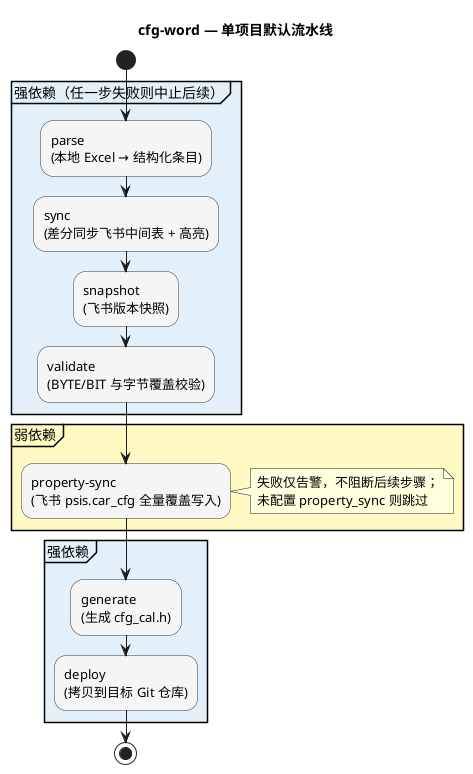

# cfg-word 工具包 使用手册

> **`adk cfg-word`** — 整车配置字映射表的自动解析、飞书同步、版本快照、校验、代码生成与部署工具，一条命令完成从本地 Excel 到 `cfg_cal.h` 上线的全流程。

---

## 1. 概述

### 1.1 工具是什么

**cfg-word** 是 ADK 平台的核心工具包之一，专注于**整车配置字**（Vehicle Config）的自动化管理。它从本地 Excel 配置字源表出发，自动完成解析、飞书中间表同步、BYTE/BIT 校验、Property 表全量覆盖写入、`cfg_cal.h` 代码生成与 Git 仓库部署——取代原有的手动对比、手动下载、交互式脚本等繁琐操作。

### 1.2 痛点与价值

| 痛点（之前） | 方案（cfg-word 工具） |
|-------------|----------------------|
| 本地 Excel 更新后需**手动对比并更新**飞书中间表 | **sync** 自动差分同步，变更单元格自动高亮 |
| 手动下载中间表 xlsx，再用**交互式脚本**生成代码 | **一条命令** `adk cfg-word <项目>` 完成全流程 |
| BYTE/BIT 校验靠人工核算，**容易遗漏** | **validate** 自动校验每个 BYTE 的 bit 之和、字节覆盖完整性 |
| 飞书表格无版本记录，出错后**无法回溯** | **snapshot** 每次同步后自动创建命名版本快照 |
| 多个飞书表格间的数据联动靠**人工复制粘贴** | **property-sync** 自动全量覆盖写入 psis.car_cfg 子表（行序与中间表一致），并在 changeHistory 记录变更 |
| 中文配置项到英文宏名的映射**全靠记忆** | **name_mapping.json** 集中管理，`init-mapping` 一键初始化 |
| 生成的 `cfg_cal.h` 需要**手动拷贝**到目标仓库 | **deploy** 一键部署，含 Git 仓库与分支校验 |
| 原工具**交互式操作**，无法自动化 | 核心逻辑已提取重构，全程命令行驱动 |

### 1.3 核心能力一览

| 能力 | 说明 |
|------|------|
| Excel 解析 | 支持多种表格版式（ACIC、ICC、Coding DID），可扩展解析器 |
| 飞书中间表同步 | 自动差分比对，变更单元格高亮标记 |
| 版本快照 | sync 完成后自动为飞书中间表创建命名版本，便于回溯 |
| BYTE/BIT 校验 | 自动校验 bit 之和、字节覆盖范围、缺失字节检测、英文宏名唯一性 |
| Property 表同步 | 全量覆盖写入飞书 psis.car_cfg 子表，行序与中间表一致，自动清理孤立行（弱依赖，失败不阻断） |
| 代码生成 | 自动生成 `cfg_cal.h` 头文件 |
| 一键部署 | 生成后自动拷贝到目标 Git 仓库 |
| 名称映射管理 | 中文→英文宏名集中管理，支持从飞书初始化 |
| 多项目支持 | 多个项目独立配置、独立流水线、互不影响 |
| 缺失字节补全 | 自动为缺失字节插入 reserved 占位项 |

---

## 2. 快速开始

### 2.1 前置条件

- 已安装 ADK 平台（在仓库根执行 `pip install -e .`）
- 本地已有配置字源 Excel 文件
- 如需飞书同步（sync / property-sync），须完成飞书配置（见 [ADK平台使用手册 §4](ADK平台使用手册.md#4-飞书配置首次使用必读)）

### 2.2 配置项目

> **安装后文件位置**（通过 `adk cfg-word` 运行时）
>
> | 文件 | 路径 |
> |------|------|
> | 配置文件 | `~/.config/adk/tool_cfg_word/config.json` |
> | 输入 Excel | `~/.local/share/adk/tool_cfg_word/input/<厂商>/<项目>/` |
> | 输出产物 | `~/.local/share/adk/tool_cfg_word/output/<项目>/` |
> | 名称映射 | `~/.local/share/adk/tool_cfg_word/name_mapping.json` |
>
> 首次运行时，`config.json` 和 `name_mapping.json` 会自动从安装包复制到上述位置；**输入目录需要用户自行创建并放入 Excel 文件**。

1. 编辑 `~/.config/adk/tool_cfg_word/config.json`，添加项目配置
2. 将 Excel 文件放入对应的输入目录（如 `~/.local/share/adk/tool_cfg_word/input/BAIC/n50/`）
3. 运行 `adk cfg-word <项目> init-mapping` 初始化名称映射

### 2.3 第一条命令

```bash
adk cfg-word n50           # 对 n50 项目执行完整流水线
```

---

## 3. 完整流水线

### 3.1 流水线概览



### 3.2 各步骤说明

| 步骤 | 依赖类型 | 作用 | 失败处理 |
|------|---------|------|---------|
| **parse** | 强依赖 | 读取本地 Excel → 结构化 ConfigItem 列表 | 失败 → 本项目后续全部跳过 |
| **sync** | 强依赖 | 差分同步到飞书中间表，变更单元格高亮 | 失败 → 本项目后续全部跳过 |
| **snapshot** | 强依赖 | 为飞书中间表格创建命名版本快照 | 失败 → 本项目后续全部跳过 |
| **validate** | 强依赖 | BYTE 内 bit 之和为 8；字节覆盖 0~N-1 完整性；英文宏名唯一性 | 失败 → 本项目后续全部跳过 |
| **property-sync** | **弱依赖** | 全量覆盖写入飞书 psis.car_cfg 子表（行序与中间表一致，自动清理孤立行）；有变更时自动在 changeHistory 子表追加记录 | **失败仅告警**，仍继续 generate 与 deploy |
| **generate** | 强依赖 | 生成 `output/<项目>/cfg_cal.h` | 失败 → 跳过 deploy |
| **deploy** | 强依赖 | 拷贝到 `deploy.repo` 的指定分支和路径 | 失败仅影响本步 |

---

## 4. 命令参考

### 4.1 命令速查表

| 命令 | 作用 |
|------|------|
| `adk cfg-word -h` | 查看帮助 |
| `adk cfg-word -v` | 查看工具版本（注意与 `adk -v` 区分） |
| `adk cfg-word list` | 查看所有项目配置（等同 `-l`） |
| `adk cfg-word feishu-sheets` | 列出飞书文档下所有子表标题 |
| `adk cfg-word <项目>` | 对指定项目执行完整流水线 |
| `adk cfg-word <项目> parse` | 仅解析（等同 `-p`） |
| `adk cfg-word <项目> sync` | 仅同步飞书中间表（等同 `-s`） |
| `adk cfg-word <项目> snapshot` | 仅创建飞书版本快照（等同 `-S`） |
| `adk cfg-word <项目> validate` | 仅校验（等同 `-V`，大写 V） |
| `adk cfg-word <项目> property-sync` | 仅同步 Property 表（等同 `-P`，大写 P） |
| `adk cfg-word <项目> generate` | 仅生成代码（等同 `-g`，别名 `gen`） |
| `adk cfg-word <项目> deploy` | 仅部署（等同 `-d`） |
| `adk cfg-word <项目> init-mapping` | 从飞书初始化名称映射 |
| `adk cfg-word <项目> -psV` | 组合执行：解析 + 同步 + 校验 |

### 4.2 常用场景示例

**场景 1：完整流水线**

```bash
adk cfg-word n50
```

等同于 `adk cfg-word n50 -psSVPgd`，按顺序执行 parse → sync → snapshot → validate → property-sync → generate → deploy。

**场景 2：仅解析和校验**

```bash
adk cfg-word n50 -pV
```

解析 Excel 并校验 BYTE/BIT 规则，不写飞书、不生成代码。

**场景 3：仅生成代码**

```bash
adk cfg-word n50 generate
```

跳过飞书同步和校验，直接从 Excel 生成 `cfg_cal.h`。

**场景 4：初始化名称映射**

```bash
adk cfg-word n50 init-mapping
```

从飞书现有数据生成 `name_mapping.json`，适用于新项目首次接入。

**场景 5：查看飞书子表标题**

```bash
adk cfg-word feishu-sheets
```

列出飞书文档下所有子表的标题和 sheet_id，方便填写 `feishu_sheet_name`。

---

## 5. 配置说明

### 5.1 config.json 字段表

#### 飞书与解析相关

| 字段 | 必需 | 说明 |
|------|------|------|
| `feishu_document` | 推荐 | 飞书多维表格浏览器链接（顶层配置，所有项目共用） |
| `feishu_sheet_name` | 推荐 | 该项目的中间表子表标签页标题 |
| `input.dir` | 是 | 输入 Excel 目录路径（相对工作区目录 `~/.local/share/adk/tool_cfg_word/`） |
| `input.sheet` | 是 | Excel 内工作表名称（须完全一致） |
| `input.parser` | 是 | 解析器名（已注册：`n5_baic_acic`、`baic_n80_icc`、`jetour_t1v_coding`） |
| `bit_order` | 是 | `reverse` 或 `normal`，与生成头文件位序约定一致 |
| `vehicle_config_byte_count` | 是 | 正整数 N，表示总字节数（校验和补全都需要） |

#### 部署与 Property 同步

| 字段 | 必需 | 说明 |
|------|------|------|
| `deploy.repo` | 否 | 目标 Git 仓库路径，支持 `~` |
| `deploy.branch` | 否 | 部署目标分支名 |
| `deploy.target` | 否 | 仓库内相对路径（单一路径字符串） |
| `property_sync.spreadsheet` | 否 | Property 表飞书链接（支持 `/sheets/` 和 `/wiki/`） |
| `property_sync.sheet_name` | 否 | Property 表子表标题（如 `psis.car_cfg`） |

### 5.2 配置示例

```json
{
    "feishu_document": "https://xxx.feishu.cn/sheets/NC9GsxyTJhLqU5tPHkOcTnKInFR",
    "projects": {
        "n50": {
            "description": "北汽 N50/N51 配置字 (ACIC 控制器)",
            "input": {
                "dir": "input/BAIC/n50",
                "sheet": "N5系控制器配置字",
                "parser": "n5_baic_acic"
            },
            "feishu_sheet_name": "n50",
            "bit_order": "reverse",
            "vehicle_config_byte_count": 24,
            "property_sync": {
                "spreadsheet": "https://xxx.feishu.cn/sheets/...",
                "sheet_name": "psis.car_cfg"
            },
            "deploy": {
                "repo": "~/path/to/repo",
                "branch": "target_branch",
                "target": "relative/path/in/repo"
            }
        }
    }
}
```

### 5.3 name_mapping.json

中文配置项名称到英文宏名的映射，按项目分区：

```json
{
    "n50": {
        "HUD抬头显示": "HUD_TYPE",
        "AEB自动紧急制动系统": "AEB"
    }
}
```

新增的配置项如果没有映射，parse 步骤会报错并列出缺失项，手动补充即可。也可通过 `init-mapping` 从飞书现有数据自动初始化。

### 5.4 添加新项目

1. 在 `config.json` 中添加项目配置（含 `input`、`parser`、`feishu_sheet_name` 等）
2. 将输入 Excel 文件放入对应的 `input/` 子目录
3. 如需新的 Excel 格式解析器，在 `lib/parsers/` 下创建并用 `@register_parser` 注册
4. 运行 `adk cfg-word <项目> init-mapping` 初始化名称映射
5. 运行 `adk cfg-word <项目>` 测试全流程

### 5.5 已有解析器

| 解析器名 | 适用场景 |
|---------|---------|
| `n5_baic_acic`（兼容旧名 `n5x_acic`） | 北汽 N5 系 ACIC「N5系控制器配置字」版式 |
| `baic_n80_icc` | 北汽 N80「ICC配置码表」版式 |
| `jetour_t1v_coding` | 捷途 T1V「03.3.Coding DID」中 0xF011 块 |

不同项目使用对应的解析器，**不可跨项目混用**。

---

## 6. 飞书权限

cfg-word 工具包需要以下飞书权限：

| 权限 | 用途 | 必需场景 |
|------|------|---------|
| `sheets:spreadsheet` | Sheets API 读写表格数据 | sync / init-mapping / property-sync / feishu-sheets |
| `drive:drive:version` | Drive API 创建文档版本 | snapshot |
| `application:application:app_info` | 获取应用信息 | property-sync（changeHistory 记录应用名） |

此外，需将飞书应用添加为**每个目标表格**的协作者，且权限为**可编辑**（sync / property-sync 需要写入）。

**需要配置权限的飞书表格：**

| 表格 | 链接 | 用途 |
|------|------|------|
| 配置字中间表 | https://t83dfrspj4.feishu.cn/sheets/NC9GsxyTJhLqU5tPHkOcTnKInFR | sync / init-mapping / feishu-sheets |
| Property 表（北汽） | https://t83dfrspj4.feishu.cn/sheets/DN95s3UyDhNOOutinLrcyxAKnEf | property-sync（n50 / n80） |
| Property 表（捷途） | https://t83dfrspj4.feishu.cn/wiki/FKBewbQJiioQZ4kRZbKcSo1enfd | property-sync（t1v） |

用户首次使用前，需在上述每个表格中将飞书应用添加为**可编辑**协作者。

---

## 7. 常见问题

| 现象 | 解决方法 |
|------|----------|
| parse 报缺少英文宏名 | 执行 `adk cfg-word <项目> init-mapping` 或手动编辑 `name_mapping.json` 补全映射 |
| validate 提示未配置 `vehicle_config_byte_count` | 在 config.json 该项目下添加正整数 N |
| validate 报 bit 之和不为 8 | 检查 Excel 中对应 BYTE 的位定义，确保 bit 总和正确 |
| sync / feishu-sheets 鉴权失败 | 检查 `FEISHU_APP_ID` / `FEISHU_APP_SECRET`，确认应用已为对应表格协作者 |
| deploy 无法切换分支 | 目标仓库有未提交修改，先提交或 stash 再重试 |
| `-v` 和 `-V` 混淆 | `-v` 查看版本号，`-V`（大写）执行校验动作 |
| feishu_sheet_name 不知道填什么 | 运行 `adk cfg-word feishu-sheets` 查看所有子表标题 |

---

## 8. 版本历史

| 版本 | 日期 | 变更摘要 |
|------|------|----------|
| **1.3.2** | 2026/4/27 | t1v reserved 判定增加兜底：英文名经标准化（去除非字母数字字符）后为空也判定为 reserved，修复"/"未被识别为 reserved 的问题 |
| **1.3.1** | 2026/4/27 | 1. t1v reserved 判定改为仅看英文名（去除中文名"预留""/"判定，以英文名为唯一依据）<br>2. property-sync changeHistory 变更摘要改为有序列表换行 |
| **1.3.0** | 2026/4/27 | 1. t1v 解析器重构：去除 MAX_VEHICLE_BYTE 截断，全量解析 Excel 配置项<br>2. 解析器直接从 Excel EN 列提取英文宏名并标准化（大写、下划线替换、数字开头加 N\_ 前缀、VEHICLE\_TYPE 自动追加 \_MODE）<br>3. 支持 `-` 分隔的字节和位范围（如 79-87、0-7）<br>4. E 列改为 col 9 + col 13（值描述）换行拼接，值描述改为从 col 13 获取<br>5. property-sync 改为全量覆盖写入，行序与中间表格一致，自动清理孤立行<br>6. property-sync 宏名从中间表格 D 列获取，确保两表宏名一致<br>7. validate 新增英文宏名唯一性校验<br>8. 飞书设置背景色改为分批请求（每批 100 个 range），避免大量单元格时超时<br>9. changeHistory D 列自动换行 |
| **1.2.0** | 2026/4/26 | 1. parse 阶段缺少映射时自动从飞书拉取，无需手动 init-mapping<br>2. 修复 Excel 换行符导致配置项名称与映射表不匹配（中英文间换行→空格归一化）<br>3. 修复飞书同步清背景色时行范围超出网格限制<br>4. property-sync changeHistory 子表名匹配改为忽略大小写<br>5. property-sync changeHistory 日期列改为日期格式写入、变更单元格自动高亮<br>6. 获取飞书应用名失败降级为提示，不阻断 property-sync |
| **1.1.0** | 2026/4/26 | 1. 新增 snapshot 流水线步骤，sync 后自动为飞书中间表创建命名版本快照<br>2. property-sync 的"通知周期"和"默认值"列改为数字类型写入<br>3. property-sync 变更后自动在 changeHistory 子表追加记录（日期、应用名、变更摘要）<br>4. 新增飞书应用名获取（get_app_name）<br>5. 首次使用体验优化：输入目录/文件缺失时给出明确路径提示 |
| **1.0.0** | 2026/4/9 | 1. 实现本地 Excel 配置字解析（parse），支持多种表格版式解析器（ACIC、ICC、Coding DID）<br>2. 实现飞书中间表差分同步（sync），变更单元格自动高亮<br>3. 实现 BYTE/BIT 校验（validate），含 bit 之和、字节覆盖完整性检查<br>4. 实现 Property 表增量更新（property-sync），弱依赖不阻断后续步骤<br>5. 实现 `cfg_cal.h` 代码生成（generate）与 Git 仓库部署（deploy）<br>6. 实现中文→英文宏名映射管理（name_mapping.json + init-mapping）<br>7. 实现缺失字节自动补全（vehicle_config_byte_count 配置）<br>8. 多项目支持，独立配置、独立流水线、互不影响 |

---

**文档版本**：对齐工具包 **v1.3.2**
