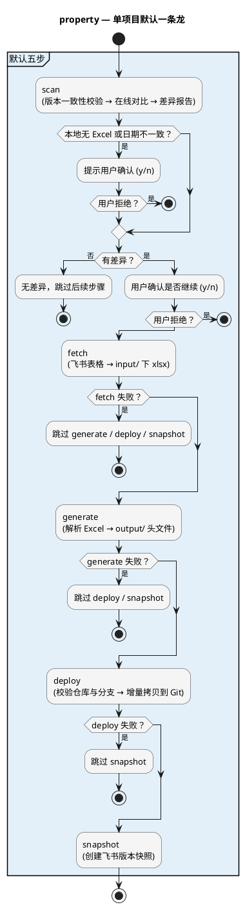

# property 工具包 使用手册

> **`adk property`** — 车辆属性（CarProperty）代码自动生成与部署工具，一条命令完成从飞书表格拉取到 Git 仓库部署的全流程。

---

## 1. 概述

### 1.1 工具是什么

**property** 是 ADK 平台的核心工具包之一，专注于车载 SOC 平台 CarPropertyManager 模块的**代码自动生成**。它从飞书在线表格自动下载属性定义表，解析 Excel 数据，通过模板引擎生成 C/C++ 头文件，并一键部署到目标 Git 仓库——全程自动化，无需手动操作。

### 1.2 痛点与价值

| 痛点（之前） | 方案（property 工具） |
|-------------|----------------------|
| 每次 Excel 更新后需**手动运行原始工具**，操作步骤多、易出错 | **一条命令** `adk property <项目>` 完成全流程 |
| 需要**手动从飞书下载**在线表格，手动重命名、手动拷贝 | **fetch** 自动从飞书下载，自动命名，历史版本自动保留 |
| 不确定线上表格是否有变化，**信息滞后** | **scan** 在线差异扫描，逐单元格对比，增/删/改颜色高亮 |
| 生成的文件**散落在工具内部**多个目录，缺少按项目分类 | 按项目/变体自动组织 `output/` 目录结构 |
| 同一项目多个版本的 Excel，需要**人工判断最新版** | **自动版本识别**，从文件名提取日期，选取最新版 |
| 生成的代码需要**手动拷贝**到目标 Git 仓库，路径深、容易拷错 | **deploy** 一键部署，自动校验仓库、分支、增量拷贝 |
| 原工具不支持**多项目**，无法批量处理 | **多项目配置**，一次处理多个项目，互不影响 |
| 版本快照需手动在飞书中创建 | **snapshot** 自动在飞书创建版本快照，与本地文件一一对应 |

### 1.3 核心能力一览

| 能力 | 说明 |
|------|------|
| 在线差异扫描 | 从飞书在线读取最新数据，与本地 Excel 逐单元格对比，差异颜色高亮展示 |
| 飞书表格自动下载 | 从飞书自动下载电子表格，支持 `/sheets/` 和 `/wiki/` 两种 URL |
| C/C++ 代码生成 | 基于 Jinja2 模板引擎，生成进程级 Property Config、PSIS 配置等头文件 |
| 多项目管理 | 通过 `config.json` 配置多个项目，支持批量或按项目名指定处理 |
| 多变体输出 | 支持同一 Excel 生成多套文件（如 n50/n51/n80），灵活控制变体 |
| 自动版本识别 | 从 Excel 文件名中提取日期，自动选取最新版本 |
| 一键部署 | 生成后自动将文件增量拷贝到目标 Git 仓库，含完整安全校验 |
| 版本快照 | 在飞书表格中创建命名版本快照，与本地文件一一对应 |
| 信号名校验 | 生成阶段自动校验信号名合法性，跳过无效数据并输出警告 |

---

## 2. 快速开始

### 2.1 前置条件

- 已安装 ADK 平台（在仓库根执行 `pip install -e .`）
- 如需在线操作（scan / fetch / snapshot），须完成飞书配置（见 [ADK平台使用手册 §4](ADK平台使用手册.md#4-飞书配置首次使用必读)）

### 2.2 配置项目

编辑 `tools/tool_property/config.json`，添加项目配置：

```json
{
    "projects": {
        "BAIC": {
            "description": "北汽 BQ_8775 CarProperty 配置",
            "spreadsheet_token": "https://xxx.feishu.cn/sheets/DN95s3UyDhNOOutinLrcyxAKnEf",
            "deploy": {
                "repo": "~/BAIC_8775/n50_al_dev/qnx/vendor/autolink/frameworks/cm",
                "branch": "al_dev",
                "targets": {
                    "n50": "carpropertymanager/impl/common/generated/n50",
                    "n51": "carpropertymanager/impl/common/generated/n51"
                }
            }
        }
    }
}
```

### 2.3 获取 Excel 表格

**方式一：自动下载（推荐）**

配置好 `spreadsheet_token` 和飞书环境变量后：

```bash
adk property BAIC fetch
```

下载后文件以 `{原始标题}_{YYYYMMDD}.xlsx` 格式保存到 `input/<项目名>/`。`input/` 中的历史文件不会被删除，每次下载新增一个带日期的文件（同日重复下载覆盖当日版本）。

> fetch 对飞书在线表格**严格只读**——整个流程中没有任何修改表格内容的操作，请放心使用。

**方式二：手动放入**

将 Excel 文件放入 `input/<项目名>/` 目录。文件名中需包含日期，支持以下格式：

| 格式 | 示例 |
|------|------|
| YYYYMMDD | `car_property_list_bq_8775_20260405.xlsx` |
| YYYY_MM_DD | `CarProperty_2025_04_05.xlsx` |
| YYYY-MM-DD | `CarProperty_2025-04-05.xlsx` |
| YYMMDD | `CarProperty_250405.xlsx` |

同一项目下有多个表格时，自动选取日期最新的进行处理。

### 2.4 第一条命令

```bash
adk property BAIC          # 对 BAIC 项目执行完整流水线
```

---

## 3. 完整流水线

### 3.1 流水线概览



### 3.2 各步骤说明

| 步骤 | 作用 | 失败处理 |
|------|------|---------|
| **scan** | 版本一致性校验 → 在线逐单元格对比 → 增/删/改差异报告 | 出错或用户拒绝 → 后续步骤全部跳过 |
| **fetch** | 从飞书下载电子表格到 `input/` 目录 | 失败 → 跳过 generate / deploy / snapshot |
| **generate** | 解析 Excel，通过 Jinja2 模板生成 C/C++ 头文件 | 失败 → 跳过 deploy / snapshot |
| **deploy** | 校验 Git 仓库 → 切换分支 → 增量拷贝文件 | 失败 → 跳过 snapshot |
| **snapshot** | 在飞书表格中创建命名版本快照 | 失败仅影响本步 |

**失败语义**：每步依赖其上游所有已选步骤全部成功；任一步失败或被用户跳过，其下游步骤均自动跳过（以项目为粒度）。

### 3.3 部署安全机制

deploy 步骤内置以下安全检查，确保不会误操作：

| 检查项 | 处理 |
|--------|------|
| 仓库路径不存在 | 终止并提示检查 config |
| 非有效 Git 仓库 | 终止 |
| 有未提交修改 | 终止并列出修改文件 |
| 分支切换失败 | 终止并报错 |

工具**不执行** `git commit` 或 `git push`，部署后请自行提交。

---

## 4. 命令参考

### 4.1 命令速查表

| 命令 | 作用 |
|------|------|
| `adk property -h` | 查看帮助 |
| `adk property -v` | 查看工具版本 |
| `adk property list` | 查看所有项目配置及状态（等同 `-l`） |
| `adk property <项目>` | 对指定项目执行完整流水线 |
| `adk property <项目> scan` | 仅扫描差异 |
| `adk property <项目> fetch` | 仅下载表格（等同 `-f`） |
| `adk property <项目> generate` | 仅生成代码（等同 `-g`） |
| `adk property <项目> deploy` | 仅部署到仓库（等同 `-d`） |
| `adk property <项目> snapshot` | 仅创建版本快照（等同 `-s`） |
| `adk property <项目> -fg` | 组合执行：下载 + 生成 |

### 4.2 常用场景示例

**场景 1：检查线上表格是否有变更**

```bash
adk property <项目> scan
```

仅展示差异报告，不执行后续操作。增（绿）、删（红）、改（黄）颜色高亮。

**场景 2：仅更新本地 Excel**

```bash
adk property <项目> fetch
```

从飞书下载最新表格到 `input/<项目>/`，不执行生成和部署。

**场景 3：本地已有 Excel，仅生成并部署**

```bash
adk property <项目> -gd
```

跳过 scan 和 fetch，直接使用本地最新 Excel 生成代码并部署。

---

## 5. 配置说明

### 5.1 config.json 字段表

| 字段 | 必需 | 说明 |
|------|------|------|
| `description` | 是 | 项目描述，用于 CLI 输出展示 |
| `spreadsheet_token` | 否 | 飞书表格 URL（支持 `/sheets/` 和 `/wiki/` 格式），scan / fetch / snapshot 使用 |
| `variant_names` | 否 | 多变体映射（输出目录名 → 内部源名），用于一张 Excel 生成多套文件 |
| `deploy.repo` | 否 | 目标 Git 仓库本地路径，支持 `~` |
| `deploy.branch` | 否 | 部署的目标分支名 |
| `deploy.targets` | 否 | 输出标签 → 仓库内相对路径的映射 |

### 5.2 通用项目配置示例

单变体项目，生成文件直接放在 `output/项目名/` 下：

```json
{
    "projects": {
        "T1V": {
            "description": "捷途 Jetour T1V CarProperty 配置",
            "spreadsheet_token": "https://xxx.feishu.cn/wiki/FKBewbQJiioQZ4kRZbKcSo1enfd",
            "deploy": {
                "repo": "~/Jetour_T1V_8775/qnx/vendor/autolink/frameworks/cm",
                "branch": "al_chery-t1v_dev",
                "targets": {
                    "t1v": "carpropertymanager/impl/common/generated/t1v"
                }
            }
        }
    }
}
```

### 5.3 多变体项目配置示例

当 Excel 中存在多个变体（如 `psis.car_cfg.n80` sheet），通过 `variant_names` 控制输出：

```json
{
    "projects": {
        "BAIC": {
            "description": "北汽 BQ_8775 CarProperty 配置",
            "spreadsheet_token": "https://xxx.feishu.cn/sheets/DN95s3UyDhNOOutinLrcyxAKnEf",
            "variant_names": {
                "n50": "base",
                "n51": "base",
                "n80": "n80"
            },
            "deploy": {
                "repo": "~/BAIC_8775/n50_al_dev/qnx/vendor/autolink/frameworks/cm",
                "branch": "al_dev",
                "targets": {
                    "n50": "carpropertymanager/impl/common/generated/n50",
                    "n51": "carpropertymanager/impl/common/generated/n51",
                    "n80": "carpropertymanager/impl/common/generated/n80"
                }
            }
        }
    }
}
```

- **key** = 最终输出目录名（`n50`、`n51`、`n80`）
- **value** = 生成引擎的内部源名（`base` 为基础变体，其他名称来自 Excel sheet 后缀）
- 多个 key 指向同一 source 时，第一个重命名，其余自动创建完整副本

### 5.4 添加新项目

1. 在 `config.json` 的 `projects` 中添加新项目配置
2. 配置 `spreadsheet_token` 为飞书表格 URL
3. 如有多变体需求，配置 `variant_names`
4. 配置 `deploy` 部署目标（可选）
5. 运行 `adk property <项目名> fetch` 下载表格并验证

---

## 6. 输入与输出

### 6.1 Excel 表格格式要求

工具读取 `.xlsx` 文件，要求包含以下 Sheet：

| Sheet 名 | 用途 |
|----------|------|
| `ChangeHistory` | 变更记录（日期 + 说明），用于生成文件头部的版本信息 |
| `statistic` | 进程与 PPS 对象的订阅矩阵 |
| `{domain}.{group}` | 属性定义（如 `psis.car_cfg`、`psis.usr_cfg`、`custom.mcu`） |
| `{domain}.{group}.{variant}` | 变体 Sheet（如 `psis.car_cfg.n80`），定义特定变体的差异化配置 |

信号名格式要求：每行第 1 列为信号名，须以字母或下划线开头，仅包含字母、数字和下划线。不合法的值会被自动跳过并输出警告。

### 6.2 生成的文件

| 文件 | 说明 |
|------|------|
| `{进程名}_property_cfg.h` | 各进程（HMI、CM、DMS 等）的 Property Config 头文件 |
| `psis_property_cfg.h` | PSIS 域（car_cfg + usr_cfg）的汇总配置 |
| `property_object_cfg.h` | PropertyObject 数据统计与缓冲区配置 |

多变体项目中，每个变体的文件列表相同，但内容根据变体对应的 Sheet 数据有所不同。

---

## 7. 飞书权限

property 工具包需要以下飞书权限：

| 权限 | 用途 | 必需场景 |
|------|------|---------|
| `sheets:spreadsheet` | Sheets API 读取表格数据 | scan / fetch |
| `drive:drive` | Drive Export API 导出 xlsx（可选，提供更快体验） | fetch |

此外，需将飞书应用添加为每个目标表格的**协作者**：

- scan / fetch：至少「可阅读」权限
- snapshot：需要「可编辑」权限

---

## 8. 常见问题

| 现象 | 解决方法 |
|------|----------|
| fetch 报 403 | 检查飞书应用权限是否已审批、目标表格是否已添加应用为协作者 |
| scan 报版本不一致 | 本地 Excel 日期与飞书最新快照日期不一致，属正常提示，确认后继续即可 |
| generate 报无效信号名警告 | 检查并修正飞书源表格中对应单元格的数据（常见：误粘贴文件路径、URL 等） |
| deploy 报仓库有未提交修改 | 先在目标仓库提交或 stash 修改，再重试 |
| deploy 报分支切换失败 | 确认 `deploy.branch` 配置正确，且目标仓库工作区干净 |
| 多变体输出目录不对 | 检查 `variant_names` 配置，确保 key（目录名）和 value（源名）映射正确 |
| `spreadsheet_token` 格式不确定 | 直接粘贴飞书表格的浏览器 URL 即可，工具自动解析 |

---

## 9. 版本历史

| 版本 | 日期 | 变更摘要 |
|------|------|----------|
| **1.2.1** | 2026/4/24 | 1. 修复 `fetch_project` 函数定义缺失导致 scan 后执行 fetch 报错 |
| **1.2.0** | 2026/4/22 | 1. 新增 `scan` 在线差异扫描命令（飞书与本地逐单元格对比、增/删/改颜色高亮）<br>2. `snapshot` 独立为单独命令，不再绑定在 fetch 内<br>3. 流水线扩展为 scan → fetch → generate → deploy → snapshot 五步<br>4. 新增版本一致性校验（本地 Excel 日期 vs 飞书最新快照日期）<br>5. scan 作为流水线前置门控，无差异自动跳过后续步骤 |
| **1.1.0** | 2026/4/16 | 1. 新增飞书 Wiki URL 自动解析（`/wiki/` 格式）<br>2. 新增多变体输出支持（`variant_names` 配置）<br>3. 新增一键部署到 Git 仓库（含完整安全校验）<br>4. 新增信号名合法性校验（自动跳过无效数据并警告） |
| **1.0.0** | 2026/4/15 | 1. 实现飞书表格自动下载（fetch，含 Drive Export 降级方案）<br>2. Excel 解析与 C/C++ 代码生成（基于 Jinja2 模板引擎）<br>3. 多项目配置管理（config.json）<br>4. 自动版本识别（文件名日期提取）<br>5. 端到端一条龙（fetch → generate → deploy） |

---

**文档版本**：对齐工具包 **v1.2.1**
