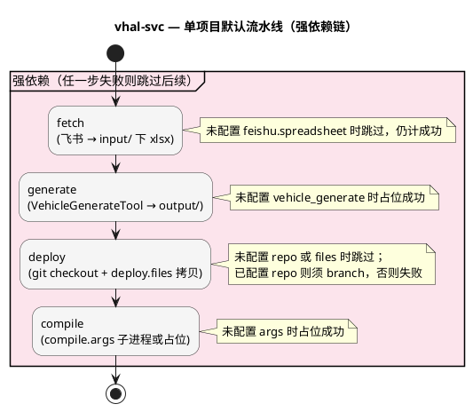

# vhal-svc 工具包 使用手册

> **`adk vhal-svc`** — 基于飞书 VHAL 矩阵表，自动完成表格拉取、代码生成、Git 仓库部署与编译的全流程工具。

---

## 1. 概述

### 1.1 工具是什么

**vhal-svc** 是 ADK 平台的核心工具包之一，专注于 **VHAL（Vehicle HAL）矩阵表**驱动的 VehicleService 侧代码生成与部署。它内嵌 VehicleGenerateTool 生成引擎，从飞书在线矩阵表自动下载数据，调用生成脚本产出源文件，并按规则部署到目标 Git 仓库——四步强依赖链自动执行，大幅减少人工操作。

### 1.2 痛点与价值

| 痛点（之前） | 方案（vhal-svc 工具） |
|-------------|----------------------|
| 需要**手动从飞书下载** VHAL 矩阵表 | **fetch** 自动从飞书导出 xlsx，支持 `/sheets/` 和 `/wiki/` URL |
| 下载后需**手动运行生成脚本**，参数多、易出错 | **generate** 自动调用 VehicleGenerateTool，参数从配置读取 |
| 生成产物需**手动逐文件拷贝**到 Git 仓库深层目录 | **deploy** 按规则自动拷贝，支持一源多目标部署 |
| 部署后需**手动切分支、手动编译** | **compile** 自动执行编译命令（可配置或占位） |
| 多个项目（n5x / n80 / t1v）需**逐个手动处理** | **多项目支持**，一条命令批量处理所有项目 |
| 全流程任一环节断裂，需要**从头重来** | **强依赖链**自动管理，失败步骤精准定位，支持从指定步骤恢复 |

### 1.3 核心能力一览

| 能力 | 说明 |
|------|------|
| 飞书矩阵表拉取 | 从飞书自动导出 VHAL 矩阵表到本地 |
| 代码生成 | 调用内嵌 VehicleGenerateTool 生成 VehicleService 侧源文件 |
| 多文件部署 | 按 `deploy.files` 规则拷贝到 Git 仓库，支持一源多目标 |
| 编译支持 | 可配置编译命令，或使用占位模式先打通流水线 |
| 强依赖链 | fetch → generate → deploy → compile 严格依赖，失败精准跳过 |
| 多项目管理 | n5x / n80 / t1v 等多项目独立配置、独立执行 |

---

## 2. 快速开始

### 2.1 前置条件

- 已安装 ADK 平台（在仓库根执行 `pip install -e .`）
- 如需在线拉表（fetch），须完成飞书配置（见 [ADK平台使用手册 §4](ADK平台使用手册.md#4-飞书配置首次使用必读)）

### 2.2 配置项目

编辑 `tools/tool_vhal_svc/config.json`，主要配置输入源、生成脚本参数和部署规则。

### 2.3 第一条命令

```bash
adk vhal-svc n5x           # 对 n5x 项目执行完整流水线
```

---

## 3. 完整流水线

### 3.1 流水线概览



### 3.2 各步骤说明

| 步骤 | 作用 | 未配置时 | 失败处理 |
|------|------|---------|---------|
| **fetch** | 从飞书导出矩阵表到 `input/` | 跳过（计为成功） | 本项目后续步骤全部跳过 |
| **generate** | 调用 VehicleGenerateTool 生成源文件 | 占位成功 | 本项目后续步骤全部跳过 |
| **deploy** | 按 `deploy.files` 规则拷贝到 Git 仓库 | 跳过（计为成功） | 本项目后续步骤全部跳过 |
| **compile** | 执行配置的编译命令 | 占位成功 | 仅影响本步 |

**强依赖含义**：对单个项目，仅当上游步骤已成功，下游步骤才会执行。上游失败时，下游步骤打印「已跳过」。

---

## 4. 命令参考

### 4.1 命令速查表

| 命令 | 作用 |
|------|------|
| `adk vhal-svc -h` | 查看帮助 |
| `adk vhal-svc -v` | 查看工具版本 |
| `adk vhal-svc list` | 查看所有项目配置摘要（等同 `-l`） |
| `adk vhal-svc <项目>` | 对指定项目执行完整流水线 |
| `adk vhal-svc <项目> fetch` | 仅拉取飞书表（等同 `-f`） |
| `adk vhal-svc <项目> generate` | 仅生成代码（等同 `-g`，别名 `gen`） |
| `adk vhal-svc <项目> deploy` | 仅部署到仓库（等同 `-d`） |
| `adk vhal-svc <项目> compile` | 仅编译（等同 `-c`） |
| `adk vhal-svc <项目> -fgdc` | 组合执行四步（与默认等价） |

### 4.2 常用场景示例

**场景 1：完整流水线**

```bash
adk vhal-svc n5x
```

按顺序执行 fetch → generate → deploy → compile。

**场景 2：仅更新本地矩阵表**

```bash
adk vhal-svc n5x fetch
```

从飞书下载最新矩阵表到 `input/n5x/`，不执行生成和部署。

**场景 3：本地已有矩阵表，仅生成并部署**

```bash
adk vhal-svc n5x -gd
```

跳过 fetch，直接使用本地矩阵表生成代码并部署。

**场景 4：调试生成脚本**

```bash
export VHAL_SVC_GEN_VERBOSE=1
adk vhal-svc n5x generate
```

打印 VehicleGenerateTool 的完整输出，便于排查问题。

---

## 5. 配置说明

### 5.1 config.json 字段表

#### 输入与飞书

| 字段 | 必需 | 说明 |
|------|------|------|
| `input.dir` | 推荐 | 输入目录路径（相对工具包根），缺省为 `input/<项目名>` |
| `feishu.spreadsheet` | 否 | 飞书矩阵表 URL（支持 `/sheets/` 和 `/wiki/`），未配置时 fetch 跳过 |

#### 生成脚本

| 字段 | 必需 | 说明 |
|------|------|------|
| `vehicle_generate.script` | 否 | 生成脚本文件名，默认 `vehicle_generate_tool_QA.py` |
| `vehicle_generate.matrix_file` | 否 | `auto` / `latest` / 留空 = 使用最新 xlsx；也可指定具体文件名 |
| `vehicle_generate.map_sheet` | 是（配置 generate 时） | 矩阵主表名，如 `releaseMap` |
| `vehicle_generate.project_code` | 否 | 脚本第二参数，缺省为项目键名 |

#### 生成输出与部署

| 字段 | 必需 | 说明 |
|------|------|------|
| `generate.output_dir` | 否 | 输出目录路径，默认 `output/<项目名>` |
| `generate.copy_result_dir` | 否 | 默认 `true`，将生成结果同步到 output_dir |
| `deploy.repo` | 否 | 目标 Git 仓库路径，支持 `~`，未配置时 deploy 跳过 |
| `deploy.branch` | 执行 deploy 时必需 | 部署前 checkout 的目标分支 |
| `deploy.files` | 执行 deploy 时必需 | 数组，每项含 `source`（源文件名）和 `dest`（仓库内相对目录） |

#### 编译

| 字段 | 必需 | 说明 |
|------|------|------|
| `compile.cwd` | 否 | 编译命令的工作目录 |
| `compile.args` | 否 | argv 列表，为空或未配置时占位成功 |

### 5.2 deploy.files 配置示例

`deploy.files` 是一个数组，支持同一源文件部署到多个目标：

```json
{
    "deploy": {
        "repo": "~/BAIC_8775/n50_al_dev/qnx/vendor/autolink",
        "branch": "al_dev",
        "files": [
            {
                "source": "InitPropConfigs_N50.cpp",
                "dest": "hal/vehicleservice/generated/n50"
            },
            {
                "source": "VehiclePropertyConfig_N50.h",
                "dest": "hal/vehicleservice/generated/n50"
            }
        ]
    }
}
```

### 5.3 添加新项目

1. 在 `config.json` 的 `projects` 中添加新项目配置
2. 配置 `feishu.spreadsheet` 为飞书矩阵表 URL
3. 配置 `vehicle_generate`（`map_sheet`、`project_code` 等）
4. 确保 `vehicle_generate/template/` 下存在对应的 `InitPropConfigs_<project_code>.cpp` 模板
5. 配置 `deploy.files` 部署规则
6. 运行 `adk vhal-svc <项目名>` 测试全流程

---

## 6. 飞书权限

vhal-svc 工具包需要以下飞书权限：

| 权限 | 用途 | 必需场景 |
|------|------|---------|
| `sheets:spreadsheet` | Sheets API 读取矩阵表数据 | fetch |
| `drive:drive` | Drive Export API 导出 xlsx（可选，提供更快体验） | fetch |

此外，需将飞书应用添加为目标矩阵表的**协作者**（至少「可阅读」权限）。

---

## 7. 常见问题

| 现象 | 解决方法 |
|------|----------|
| fetch 报凭证错误 | 检查 `FEISHU_APP_ID` / `FEISHU_APP_SECRET`，确认应用已为表格协作者 |
| generate 报 input 下无 xlsx | 先执行 fetch，或手动放入矩阵表文件 |
| generate 报 map_sheet 需配置 | 在 `vehicle_generate` 中填写 `map_sheet`（如 `releaseMap`） |
| deploy 报需配置 deploy.branch | 执行 deploy 时必须提供 branch 配置 |
| deploy 报源文件不存在 | 确认 generate 已成功，且 output_dir 下存在 deploy.files 中的 source 文件 |
| 强依赖链中途跳过 | 查看最先失败的步骤日志，修复后从该步重新执行 |
| 生成脚本输出太多/太少 | 设置 `VHAL_SVC_GEN_VERBOSE=1` 查看完整输出 |

---

## 8. 版本历史

| 版本 | 日期 | 变更摘要 |
|------|------|----------|
| **0.3.4** | 2026/4/15 | 1. 实现飞书 VHAL 矩阵表自动下载（fetch，含 Drive Export 降级方案） 2. 实现 VehicleGenerateTool 生成引擎集成（generate，含输出抑制与冗余模式） 3. 实现多文件部署到 Git 仓库（deploy，支持一源多目标与 `deploy.files` 配置） 4. 实现编译命令支持（compile，可配置或占位） 5. 四步强依赖链管理（fetch → generate → deploy → compile） 6. 多项目支持（n5x / n80 / t1v），独立配置、独立流水线 |

---

**文档版本**：对齐工具包 **v0.3.4**
