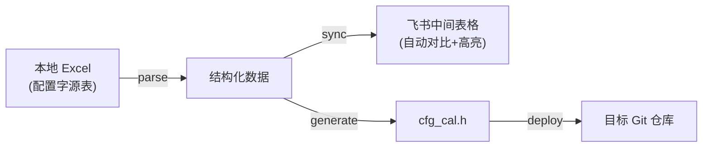

# cfg-word（工具包 `tools/tool_cfg_word`）通用工具实现计划

本文档为实施计划的**工作区副本**，便于与仓库一同版本管理。若与 Cursor 中的计划文件有出入，以你最终确认的约定为准。

## 现状理解：当前流程（手动）


## 目标流程（自动化）



## 目录结构设计（摘要）

```
tools/tool_cfg_word/
  main.py                 # CLI 入口 + 流水线编排
  config.json             # 项目配置
  name_mapping.json       # 中文描述 -> 英文宏名映射
  requirements.txt
  README.md
  PLAN.md                 # 本文件
  input/                  # 输入 Excel（按项目分目录）
  output/                 # 生成产物（按项目）
  lib/
    feishu_api.py
    feishu_sync.py
    name_mapping.py
    version_detect.py
    codegen.py
    deploy.py
    parsers/
      __init__.py
      n5x_acic.py          # 注册名 n5_baic_acic / n5x_acic
      baic_n80_icc.py      # 注册名 baic_n80_icc
      jetour_t1v_coding.py # 注册名 jetour_t1v_coding
```

## 核心设计决策（摘要）

1. **config.json**：`feishu_document`（浏览器链接，推荐）或 `feishu_spreadsheet`（token）；各项目的 `input`、`feishu_sheet_name`（子表标题，推荐）或 `feishu_sheet_id`、`bit_order`、`deploy`。
2. **name_mapping.json**：按项目分区，中文描述 → 英文宏名；可从飞书 `init-mapping` 初始化。
3. **解析器**：`lib/parsers/` 中注册，`parser` 字段按名称选择。
4. **飞书 sync**：读旧数据 → 对比 → 清非表头背景色 → 写新数据 → 差异单元格黄色。
5. **代码生成**：`lib/codegen.py` 内存数据生成 `cfg_cal.h`。
6. **部署**：校验仓库、切换分支、拷贝文件，不自动 commit。

## 实现要点

- **版本检测**：文件名中的日期（YYYYMMDD）等，选取最新 Excel。
- **飞书 API**：`FEISHU_APP_ID` / `FEISHU_APP_SECRET`。
- **错误处理**：name_mapping 缺失则中止；部署前工作区需干净才能切分支。
- **幂等性**：sync 全量替换数据行；generate 覆盖输出文件。
