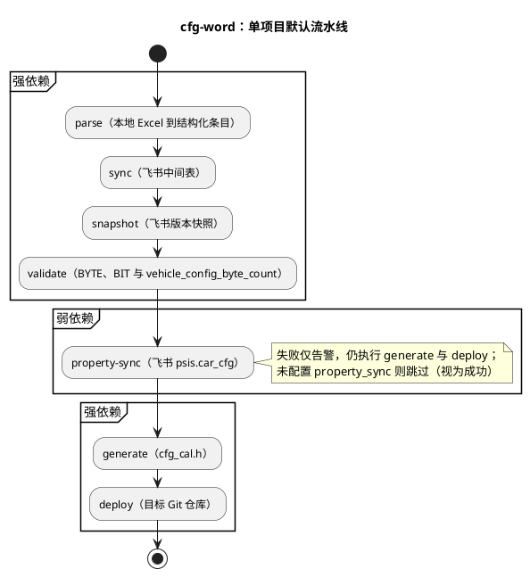

# tool_cfg_word 工具包（`adk cfg-word`）

**平台 CLI：`cfg-word`** — **整车配置字映射表**的生成、更新维护与部署；并可在 **carpropertylist 在线表格**中全量维护 **psis.car_cfg** 子表（`property-sync`）。平台总说明见 [AutoDriveKit README](../../README.md)；在仓库根 **`pip install -e .`** 后推荐使用 **`adk cfg-word …`**，参数与本目录 **`python3 main.py …`** 完全一致。

## 1. 文档导航

（以下为本文小节索引，与正文标题一致。）

- **1. 文档导航** — 本节
- **2. 能力一览** — 子命令、短选项、多项目行为
- **3. 调用方式** — `adk cfg-word` 与 `python3 main.py`
- **4. 文档与计划** — PLAN、现状与目标流程图
- **5. 流水线** — 强依赖与弱依赖
- **6. 流水线图（PlantUML）** — 默认步骤活动图
- **7. 安装** — 依赖与飞书环境变量
- **8. 快速开始** — 常用命令示例
- **9. 目录结构** — 代码与数据目录
- **10. 配置文件** — `config.json`、`name_mapping.json`
- **11. 添加新项目** — 扩展流程
- **12. 版本检测** — 文件名日期识别
- **13. 配置完整性检查** — 上线前自检表
- **14. 常见问题** — 映射缺失、校验、飞书鉴权、deploy
- **15. 版本历史** — 各版本变更记录

## 2. 能力一览

### 2.1 默认与解析类动作

| 动作 | 别名 | 说明 |
|------|------|------|
| （无动作参数） | — | 默认跑满 **parse → sync → snapshot → validate → property-sync → generate → deploy**（与下文「端到端默认流水线」一致） |
| `parse` | `-p` | 读本地 Excel → 结构化条目；失败则本项目后续步骤中止 |
| `sync` | `-s` | 同步到飞书**中间表**（差分与高亮） |
| `snapshot` | `-S` | 为飞书中间表格创建**命名版本快照** |
| `validate` | **`-V`（大写）** | BYTE 内 bit 之和为 8；**`vehicle_config_byte_count`** 须覆盖字节 **0 到 N-1**；英文宏名唯一性检查；未配置 N 时本步失败（见配置节） |

### 2.2 同步、生成与辅助动作

| 动作 | 别名 | 说明 |
|------|------|------|
| `property-sync` | **`-P`（大写）** | 全量覆盖写入独立飞书表 **psis.car_cfg**（行序与中间表格一致，自动清理孤立行）；有变更时自动在 **changeHistory** 子表追加记录；**弱依赖**，失败仅告警，仍继续 **generate** 与 **deploy** |
| `generate` | `-g`、`gen` | 生成 **`output/`** + 项目名 + **`/cfg_cal.h`** |
| `deploy` | `-d` | 拷贝到 **deploy.repo** 与 **deploy.target**；校验 Git 与分支（见 **lib/deploy.py**） |
| `list` | `-l` | 列出各项目配置与最新输入文件，**不执行**解析或同步 |
| `init-mapping` | — | 从飞书中间表初始化或更新 **name_mapping.json** |
| `feishu-sheets` | — | 列出顶层 **feishu_document** 下所有子表标题与 **sheet_id**，便于填写 **feishu_sheet_name** |

**短选项可合并**，例如 `-psV` 表示 `parse` + `sync` + `validate`；`-psSVPgd` 与默认全流程等价。

**多项目**：省略项目名时，对 `config.json` 里 **`projects` 的全部键**依次执行；**每个项目单独编排流水线**，某一项目在某步强依赖失败只会跳过**该项目**的后续步骤，其它项目仍会继续。

## 3. 调用方式

- **推荐**（已在 AutoDriveKit 根目录执行 `python3 -m pip install -e .`）：`adk cfg-word …`，参数与本目录下 **`python3 main.py …` 完全一致**。
- **本目录直接跑**：`cd tools/tool_cfg_word && python3 main.py …`。

**一条龙**：`adk cfg-word n50` 与 `python3 main.py n50` 相同，即对项目 `n50` 跑默认全流程。仅输入 `adk` 进入交互菜单时，若工具在 `adk-tool.json` 中配置了 **`interactive_project_pick`**，可先选项目再**回车**执行默认流水线。

**版本与校验选项不要混淆**：平台版本用 **`adk -v`**；本工具自身版本用 **`adk cfg-word -v`**（或 `python3 main.py -v` / `--version`）。**校验**动作为 **`-V`（大写 V）**，须写在子命令之后，例如 `adk cfg-word -V n50`。

**端到端默认流水线**（无动作参数，且不是 `list` / `init-mapping` / `feishu-sheets` 时）：`parse` → `sync` → `snapshot` → **`validate`** → **`property-sync`（弱依赖，失败不阻断 generate/deploy）** → `generate` → `deploy`。其中 `property-sync` 依赖项目内 **`property_sync`** 且 `spreadsheet` 非空；否则该步跳过（视为成功）。

## 4. 文档与计划

- **本目录**：[PLAN.md](PLAN.md) — 实施计划副本（含「现状 vs 目标」流程图）。
- **编辑器侧**：若使用 Cursor，原始计划可能位于 `.cursor/plans/` 下（文件名以 `tool_cfg_word` / `cfg-word` 等关键字可查）。

### 4.1 现状理解：当前流程（手动）

```text
本地 Excel（配置字源表）
  → 手动对比并更新 → 飞书中间表格
  → 手动下载 xlsx → 旧工具（交互式）
  → 生成 cfg_cal.h → output/
  → 手动拷贝 → 目标 Git 仓库
```

### 4.2 目标流程（本工具）

```text
本地 Excel（配置字源表）
  → parse → 结构化数据
       ├→ sync → 飞书中间表格（对比与高亮）
       ├→ validate → BYTE/BIT 校验
       ├→ property-sync → 飞书 psis.car_cfg（独立表，弱依赖）
       ├→ generate → cfg_cal.h
       └→ deploy → 目标 Git 仓库
```

## 5. 流水线（等价于上图）

强依赖步骤（任一步失败则中止本项目后续步骤）：**parse → sync → snapshot → validate → generate → deploy**。**property-sync** 为弱依赖：失败仅告警，仍继续 **generate / deploy**。

```
本地 Excel → [parse] → 结构化数据 → [sync]     → 飞书中间表格（高亮变更）
                                  → [snapshot] → 飞书版本快照
                                  → [validate] → BYTE/BIT 与总字节数等规则校验
                                  → [property-sync] → 飞书 psis.car_cfg（可选；未配置则跳过）
                                  → [generate] → cfg_cal.h
                                  → [deploy]     → 目标 Git 仓库
```

当已配置 **`vehicle_config_byte_count`**（正整数 N）时，解析阶段会对缺失字节自动补全为「整字节 8bit reserved」行；**同一 N** 亦被 **`validate`** 用于总字节范围与全覆盖检查（见下文「`vehicle_config_byte_count`」小节）。

## 6. 流水线图（PlantUML）



## 7. 安装

在 **AutoDriveKit 仓库根目录**推荐执行 `python3 -m pip install -e .`，依赖由平台 `pyproject.toml` 统一管理。仅使用本工具包时也可：

```bash
pip install -r requirements.txt
```

需要设置飞书开放平台环境变量（**`sync` / `snapshot` / `property-sync` / `init-mapping` / `feishu-sheets`** 等会访问飞书 API 的步骤需要）：

```bash
export FEISHU_APP_ID="your_app_id"
export FEISHU_APP_SECRET="your_app_secret"
```

**首次使用**：开放平台建应用、申请权限、以及向各目标飞书表格添加该应用为协作者（**可编辑** / **可管理** 等）的详细说明，见仓库根 [**AutoDriveKit README**](../../README.md) **「飞书自建应用与环境变量（首次使用必读）」**。

**需要配置权限的飞书表格：**

| 表格 | 链接 | 用途 |
|------|------|------|
| 配置字中间表 | https://t83dfrspj4.feishu.cn/sheets/NC9GsxyTJhLqU5tPHkOcTnKInFR | sync / init-mapping / feishu-sheets |
| Property 表（北汽） | https://t83dfrspj4.feishu.cn/sheets/DN95s3UyDhNOOutinLrcyxAKnEf | property-sync（n50 / n80） |
| Property 表（捷途） | https://t83dfrspj4.feishu.cn/wiki/FKBewbQJiioQZ4kRZbKcSo1enfd | property-sync（t1v） |

用户首次使用前，需在上述每个表格中将飞书应用添加为**可编辑**协作者。

## 8. 快速开始

下列命令在 **`adk cfg-word …`** 与 **`python3 main.py …`**（于 `tools/tool_cfg_word/` 下）之间可互换，仅前缀不同。

```bash
# 查看本工具版本（勿与 adk -v 混淆）
adk cfg-word -v

# 查看所有项目配置（本地最新 Excel、解析器、飞书子表、Property 表、部署路径）
adk cfg-word list

# 全流程（parse → sync → snapshot → validate → property-sync → generate → deploy），与仅写项目名等价
adk cfg-word n50

# 仅解析（不写飞书、不生成）
adk cfg-word parse n50

# 仅同步飞书中间表（流水线内仍会先 parse 再 sync）
adk cfg-word sync n50

# 仅校验（默认流水线已包含）
adk cfg-word validate n50
# 或
adk cfg-word -V n50

# 仅同步 Property 表 psis.car_cfg（需 property_sync；失败不阻断其它步骤）
adk cfg-word property-sync n50

# 仅生成 / 仅部署（generate 可使用别名 gen）
adk cfg-word generate n50
adk cfg-word gen n50
adk cfg-word deploy n50

# 组合（短选项可合并）
adk cfg-word -psV n50                       # parse + sync + validate
adk cfg-word -psSVPgd n50                   # 满流程（等同默认）
adk cfg-word -sg n50                        # parse + sync + generate
adk cfg-word -sP n50                        # parse + sync + property-sync
adk cfg-word parse sync validate n50        # 显式长名，与 -psV 等价

# 从飞书中间表初始化名称映射
adk cfg-word init-mapping n50

# 列出 config 顶层 feishu_document 下所有子表标题（填写各项目 feishu_sheet_name）
adk cfg-word feishu-sheets

# 省略项目名：对 config.json 中全部项目依次执行
adk cfg-word
```

**飞书写入**：`sync`、`init-mapping`、`property-sync` 会调用飞书 API；应用须对目标表格具备**可编辑**（或团队策略允许的更高权限），并与平台 README 中「飞书自建应用与环境变量」一节一致配置 `FEISHU_APP_ID` / `FEISHU_APP_SECRET`。

## 9. 目录结构

> **通过 `adk cfg-word` 运行时**，用户数据（`input/`、`output/`、`name_mapping.json`）位于 `~/.local/share/adk/tool_cfg_word/` 下，配置文件位于 `~/.config/adk/tool_cfg_word/config.json`。下表为仓库内的源码目录结构：

```
tools/tool_cfg_word/
  main.py                 # CLI 入口 + 流水线编排
  config.json             # 项目配置
  name_mapping.json       # 中文描述 → 英文宏名映射
  requirements.txt
  input/                  # 输入 Excel（按项目分目录）
    BAIC/n50/
  output/                 # 生成产物
    n50/cfg_cal.h
  lib/
    feishu_api.py          # 飞书 API 封装
    feishu_sync.py         # 飞书中间表同步
    property_sync.py       # 飞书 psis.car_cfg 全量覆盖同步
    name_mapping.py        # 名称映射管理
    version_detect.py      # 文件名版本/日期检测
    config_validate.py     # BYTE/BIT 与 vehicle_config_byte_count 校验
    gap_fill.py            # 缺失字节补全为 reserved
    codegen.py             # cfg_cal.h 生成
    deploy.py              # Git 仓库部署
    parsers/
      __init__.py          # 解析器注册表 + ConfigItem 模型
      n5x_acic.py          # 北汽 N5 系 ACIC（注册名 n5_baic_acic / n5x_acic）
      baic_n80_icc.py      # 北汽 N80 ICC 配置码表（baic_n80_icc）
      jetour_t1v_coding.py # 捷途 T1V Coding DID / 0xF011（jetour_t1v_coding）
```

各项目 `config.json` 中 `parser` 已对应为：`n5_baic_acic`、`baic_n80_icc`、`jetour_t1v_coding`（与表格版式一一对应，互不混用）。

## 10. 配置文件

### 10.1 config.json

#### 飞书：`feishu_document` 与 `feishu_sheet_name`

API 仍使用内部的 spreadsheet token / sheet_id，但**配置里推荐用人能看懂的内容**，由工具在运行时解析：

| 配置项 | 含义 |
|--------|------|
| **`feishu_document`**（推荐） | 飞书**多维表格在浏览器里的完整链接**（`https://…/sheets/` 后接 spreadsheet token）。工具会从 URL 路径中解析出 token。 |
| **`feishu_spreadsheet`**（兼容旧版） | 若仍想直接填 token，可继续用此项；**`feishu_document` 优先**。 |
| **`feishu_sheet_name`**（推荐） | 该项目的**中间表**所在**子表标签页标题**，须与飞书界面底部/标签上显示的文字**完全一致**（含空格、大小写）。 |
| **`feishu_sheet_id`**（兼容旧版） | 若未配置 `feishu_sheet_name`，则仍使用此项作为内部 sheet_id。 |

不知道子表标题时，先配置好 `feishu_document` 与飞书环境变量，执行：

```bash
python3 main.py feishu-sheets
```

会列出该文档下所有子表的**标题**和对应的 `sheet_id`，把标题抄进各项目的 `feishu_sheet_name` 即可。

#### `property_sync`（飞书 Property 表 `psis.car_cfg`）

与**中间表格**无关的另一份飞书**多维表格**：按项目配置 `spreadsheet`（浏览器链接，支持 `/sheets/` 与 `/wiki/`）和 `sheet_name`（子表标题，如 `psis.car_cfg`、`psis.car_cfg.n80`）。`property-sync` 步骤会按中间表格行序**全量覆盖写入**对应行（宏名从中间表格 D 列获取，确保两表一致），跳过 `reserved` 行写入，自动清理中间表格中已不存在的孤立行；更新前清除数据区背景色，再对变更单元格标黄。有变更时，自动在同一 spreadsheet 的 **changeHistory** 子表追加一条记录（日期、应用名、变更摘要）。

| 字段 | 含义 |
|------|------|
| `spreadsheet` | 目标多维表格链接或裸 token；`/wiki/...` 会自动解析为实际表格 token。 |
| `sheet_name` | 子表标签页标题，须与界面一致。 |
| `sheet_id` | （可选）旧版，直接填内部 sheet_id。 |

#### `input.parser` 是什么、怎么配

`parser` 是一个**字符串标识符**，用来选中 `lib/parsers/` 里**哪一段 Python 代码**去读你的 Excel。不同项目、不同供应商的表格**列位置、合并单元格、位定义写法**可能不同，所以每种「表格版式」对应一个解析器；工具根据 `parser` 的名字去调用已注册的解析函数，把表里的每一行配置项变成内存里的 `ConfigItem`（字节、位宽、中文名等），后面的飞书同步、代码生成都依赖这个结果。

**怎么填：**

1. **已有解析器（三项目已分立）**：在 `config.json` 的 `parser` 中填写注册名即可：
   - **`n5_baic_acic`**（兼容旧名 **`n5x_acic`**）：北汽 N5 系 ACIC「N5系控制器配置字」版式（`Bit7-Bit6(dec)` 等）。
   - **`baic_n80_icc`**：北汽 N80「ICC配置码表」版式（`Bit0`… / `ByteN（hex）`）。
   - **`jetour_t1v_coding`**：捷途 T1V「03.3.Coding DID」中 **0xF011** 块（全量解析 Excel 配置项，自动从 EN 列提取宏名并标准化）。
2. **不要跨项目混用**：三种表格列结构不同，各自只使用上面对应的解析器。
3. **版式不同要新写**：在 `lib/parsers/` 新增一个模块，实现 `parse(excel_path, sheet_name) -> list[ConfigItem]`，并用 `@register_parser("你的名字")` 注册，然后在配置里写 `"parser": "你的名字"`。

**和 `sheet` 的区别**：`sheet` 只指定**读哪个工作表**；`parser` 指定**按什么规则解析这个表里的格子**。两者都要对。

#### `vehicle_config_byte_count`（校验必配；兼管解析补全）

每个项目应配置 **正整数 N**，表示本项目配置字总字节数。

1. **校验（`validate` / 默认流水线）**：`lib/config_validate.py` 要求必须配置该字段，否则 **`validate` 直接失败**并提示补全。通过配置后，校验将检查：每个 BYTE 上各条目 **bit 之和为 8**；BYTE 落在 **0…N-1**；且 **0…N-1 每个字节在解析结果中至少出现一次**（可与飞书中表对齐）；此外还会检查**英文宏名唯一性**（非 reserved 行的宏名不得重复出现于不同 BYTE）。
2. **解析阶段补全**：在已配置 N 的前提下，解析完成后会对 **0…N-1** 中缺失的字节自动插入「整字节 8bit reserved」占位项，再进入名称映射与后续步骤；适用于表格未逐行列出、但固件约定固定总长（如 24 字节）的场景（见 `lib/gap_fill.py`）。

```json
{
    "feishu_document": "https://xxx.feishu.cn/sheets/NC9GsxyTJhLqU5tPHkOcTnKInFR",
    "projects": {
        "n50": {
            "description": "北汽 N50/N51 配置字 (ACIC 控制器)",
            "input": {
                "dir": "input/BAIC/n50",
                "sheet": "N5系控制器配置字",
                "parser": "n5_baic_acic"
            },
            "feishu_sheet_name": "n50",
            "bit_order": "reverse",
            "deploy": {
                "repo": "~/path/to/repo",
                "branch": "target_branch",
                "target": "relative/path/in/repo"
            }
        }
    }
}
```

### 10.2 name_mapping.json

中文配置项名称到英文宏名的映射，按项目分区：

```json
{
    "n50": {
        "HUD抬头显示": "HUD_TYPE",
        "AEB自动紧急制动系统": "AEB"
    }
}
```

首次使用时，可通过 `init-mapping` 从飞书现有数据自动初始化：

```bash
python3 main.py init-mapping n50
```

新增的配置项如果没有映射，parse 步骤会报错并列出缺失项，手动补充到 `name_mapping.json` 即可。

## 11. 添加新项目

1. 在 `config.json` 中添加项目配置
2. 将输入 Excel 文件放入对应的输入目录（通过 `adk` 运行时为 `~/.local/share/adk/tool_cfg_word/input/<厂商>/<项目>/`）
3. 如需新的 Excel 格式解析器，在 `lib/parsers/` 下创建并注册
4. 运行 `init-mapping` 初始化名称映射
5. 运行全流程测试

## 12. 版本检测

输入目录中可能存在多个版本的 Excel 文件。工具会自动根据文件名中的日期（YYYYMMDD）或版本号选取最新版本。

## 13. 配置完整性检查（填完再跑全流程）

对照 `config.json` 逐项确认：

### 13.1 飞书与解析相关

| 项 | 说明 |
|----|------|
| `feishu_document` / `feishu_spreadsheet` | 多维表格的**浏览器链接**（推荐）或直接填 **token**（旧版）。 |
| 每项目 `feishu_sheet_name` / `feishu_sheet_id` | **子表标签页标题**（推荐）或内部 sheet_id（旧版）；可用 `adk cfg-word feishu-sheets`（或 `python3 main.py feishu-sheets`）对照。 |
| 每项目 `input.dir` | 目录存在且内有 `.xlsx`/`.xlsm`。 |
| 每项目 `input.sheet` | 与 Excel 内**工作表名称完全一致**。 |
| 每项目 `input.parser` | 已在 `lib/parsers/` 注册的解析器名。 |
| `bit_order` | `reverse` 或 `normal`，与生成头文件位序约定一致。 |
| `vehicle_config_byte_count` | **必配正整数 N**（参与 `validate`）；并与解析阶段缺失字节补全逻辑一致。 |

### 13.2 部署、Property 与环境

| 项 | 说明 |
|----|------|
| `property_sync` | （可选）若使用 `property-sync`：`spreadsheet` 链接与 `sheet_name` 与飞书 Property 表一致。 |
| `deploy` | `repo` 展开后存在；若配置了 `branch` 则须工作区干净才能切换；**`target`** 为仓库内**单一相对路径**（字符串；非「多目标键值」式映射）。 |
| `name_mapping.json` | 按项目分区；新项目或新增配置项需在首次全流程前执行 `init-mapping` 或手工补全映射，否则 `parse` 会因缺宏名失败。 |
| 环境变量 | `FEISHU_APP_ID`、`FEISHU_APP_SECRET`（凡访问飞书 API 的步骤均需）。 |

## 14. 常见问题

| 现象 | 处理方向 |
|------|----------|
| `parse` 报缺少英文宏名 | 对该项目执行 **`init-mapping`** 并带上项目名，或编辑 `name_mapping.json` 补全中文到宏名映射。 |
| `validate` 提示未配置 `vehicle_config_byte_count` | 在 `config.json` 该项目下增加正整数 N；并确保解析结果覆盖 BYTE `0…N-1`（可依赖解析阶段自动补 reserved 字节）。 |
| `sync` / `feishu-sheets` 鉴权失败 | 检查 `FEISHU_APP_ID` / `FEISHU_APP_SECRET`，确认应用已被加为对应多维表格协作者且权限范围满足 Sheets 读写。 |
| `deploy` 无法切换分支 | 目标仓库存在未提交修改时不允许 `checkout`；先提交或 stash，再重试。 |

## 15. 版本历史

| 版本 | 日期 | 变更摘要 |
|------|------|----------|
| **1.3.2** | 2026/4/27 | t1v reserved 判定增加兜底：英文名经标准化（去除非字母数字字符）后为空也判定为 reserved，修复"/"未被识别为 reserved 的问题 |
| **1.3.1** | 2026/4/27 | 1. t1v reserved 判定改为仅看英文名（去除中文名"预留""/"判定，以英文名为唯一依据）<br>2. property-sync changeHistory 变更摘要改为有序列表换行 |
| **1.3.0** | 2026/4/27 | 1. t1v 解析器重构：去除 MAX_VEHICLE_BYTE 截断，全量解析 Excel 配置项<br>2. 解析器直接从 Excel EN 列提取英文宏名并标准化（大写、下划线替换、数字开头加 N\_ 前缀、VEHICLE\_TYPE 自动追加 \_MODE）<br>3. 支持 `-` 分隔的字节和位范围（如 79-87、0-7）<br>4. E 列改为 col 9 + col 13（值描述）换行拼接，值描述改为从 col 13 获取<br>5. property-sync 改为全量覆盖写入，行序与中间表格一致，自动清理孤立行<br>6. property-sync 宏名从中间表格 D 列获取，确保两表宏名一致<br>7. validate 新增英文宏名唯一性校验<br>8. 飞书设置背景色改为分批请求（每批 100 个 range），避免大量单元格时超时<br>9. changeHistory D 列自动换行 |
| **1.2.0** | 2026/4/26 | 1. parse 阶段缺少映射时自动从飞书拉取，无需手动 init-mapping<br>2. 修复 Excel 换行符导致配置项名称与映射表不匹配（中英文间换行→空格归一化）<br>3. 修复飞书同步清背景色时行范围超出网格限制<br>4. property-sync changeHistory 子表名匹配改为忽略大小写<br>5. property-sync changeHistory 日期列改为日期格式写入、变更单元格自动高亮<br>6. 获取飞书应用名失败降级为提示，不阻断 property-sync |
| **1.1.0** | 2026/4/26 | 1. 新增 snapshot 流水线步骤，sync 后自动为飞书中间表创建命名版本快照<br>2. property-sync 的"通知周期"和"默认值"列改为数字类型写入<br>3. property-sync 变更后自动在 changeHistory 子表追加记录（日期、应用名、变更摘要）<br>4. 新增飞书应用名获取（get_app_name）<br>5. 首次使用体验优化：输入目录/文件缺失时给出明确路径提示 |
| **1.0.0** | 2026/4/9 | 1. 实现本地 Excel 配置字解析（parse），支持多种表格版式解析器（ACIC、ICC、Coding DID）<br>2. 实现飞书中间表差分同步（sync），变更单元格自动高亮<br>3. 实现 BYTE/BIT 校验（validate），含 bit 之和、字节覆盖完整性检查<br>4. 实现 Property 表增量更新（property-sync），弱依赖不阻断后续步骤<br>5. 实现 `cfg_cal.h` 代码生成（generate）与 Git 仓库部署（deploy）<br>6. 实现中文→英文宏名映射管理（name_mapping.json + init-mapping）<br>7. 实现缺失字节自动补全（vehicle_config_byte_count 配置）<br>8. 多项目支持，独立配置、独立流水线、互不影响 |

