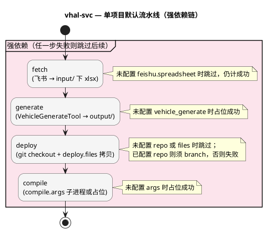

# tool_vhal_svc 工具包（`adk vhal-svc`）

**平台 CLI：`vhal-svc`**（暂定名）— 基于 **飞书 VHAL 矩阵表**，在本地调用内嵌 **VehicleGenerateTool**，生成 **vehicleservice** 侧产物，并按规则拷贝到目标 Git 仓库；可选执行占位或真实 **compile**。平台总说明见 [AutoDriveKit README](../../README.md)；在仓库根 **`pip install -e .`** 后推荐使用 **`adk vhal-svc …`**，参数与本目录 **`python3 main.py …`** 完全一致。

## 1. 文档导航

（以下为本文小节索引，与正文标题一致。）

- **2. 能力一览** — 默认流水线、强依赖、跳过语义
- **3. 调用方式** — `adk` 与 `python3`、版本号
- **4. 流水线说明** — 四步行为摘要
- **5. 流水线图（PlantUML）** — 强依赖活动图
- **6. 快速开始** — 常用命令
- **7. 目录结构** — 仓库内布局
- **8. 配置说明** — `config.json` 字段
- **9. 各步骤细节** — fetch、generate、deploy、compile
- **10. 常见问题** — 排错提示
- **11. 暂定命名** — CLI 与目录名

## 2. 能力一览

| 动作 | 短选项 | 说明 |
|------|--------|------|
| （无动作参数） | — | 默认 **`fetch` → `generate` → `deploy` → `compile`** 全开，对指定项目或全部项目依次执行 |
| `fetch` | `-f` | 从 **`feishu.spreadsheet`** 导出 **xlsx** 到 **`input/` + 项目输入目录**；未配置飞书 URL 时**跳过**（仍计为成功） |
| `generate` | `-g`、`gen` | 运行 **`vehicle_generate/`** 下脚本；未配置 **`vehicle_generate`** 时**占位**（创建输出目录即成功） |
| `deploy` | `-d` | 按 **`deploy.files`** 从 **`generate.output_dir`** 拷贝到 **`deploy.repo`**；未配置 **`deploy.repo`** 或 **`deploy.files`** 时**跳过**（仍计为成功）；**必须**配置 **`deploy.branch`** 才会真正执行拷贝，否则本步失败 |
| `compile` | `-c` | 未配置 **`compile.args`** 时占位成功；配置了非空 **`args`** 则执行子进程，失败则本步失败 |
| `list` | `-l` | 列出各项目输入目录、飞书链接摘要、生成与部署配置；**不执行**流水线 |

**短选项可合并**，例如 **`-fgdc`** 表示四步全开（与默认无参等价）。

**多项目**：命令行**省略项目名**时，对 **`config.json` → `projects`** 的全部键**依次**执行；每个项目内为**强依赖链**：任一步返回失败则**本项目**后续步骤跳过，并影响整次命令的退出码（见 `main.py` 中 `cmd_run`）。

**强依赖含义**：对单个项目，仅当 `fetch`（若在本轮动作中）已成功、`generate` 已成功……依此类推，`deploy` / `compile` 才会执行；上游失败时下游打印「已跳过」且本次运行记为失败（`sys.exit(1)`）。

## 3. 调用方式

- **推荐**：`adk vhal-svc …`（需在 AutoDriveKit 根目录已执行 `python3 -m pip install -e .`）。
- **本目录**：`cd tools/tool_vhal_svc && python3 main.py …`。

**版本号**：`adk vhal-svc -v` / `--version` 输出 **`vhal-svc v…`**（与工具包内常量一致）；**平台**版本为 **`adk -v`**。

仅输入 **`adk`** 并选择本工具时，若 **`adk-tool.json`** 配置了 **`interactive_project_pick`**，会先选 **`projects`** 中的项目键，再填写参数或回车执行默认四步。

## 4. 流水线说明

```text
飞书 VHAL 表 ──[fetch]──► input/<项目>/标题.xlsx
                              │
                              ▼
                    [generate] VehicleGenerateTool
                              │  （可选同步到 generate.output_dir）
                              ▼
         output/<项目>/ 中 deploy.files 所列源文件
                              │
                              ▼
              [deploy] git checkout 分支后按规则拷贝
                              │
                              ▼
                    [compile] 子进程（可占位）
```

- **凭证**：真正执行 **fetch** 且配置了飞书 URL 时，需要环境变量 **`FEISHU_APP_ID`**、**`FEISHU_APP_SECRET`**（与 **`adk property fetch`** 相同，见根目录 README「飞书自建应用与环境变量」）。
- **产物**：生成脚本在 **`vehicle_generate/Result<project_code>/`** 下产出；默认会将该目录**整棵同步**到 **`generate.output_dir`**（受 **`copy_result_dir`** 控制）。

## 5. 流水线图（PlantUML）

下列 **`@startuml` … `@enduml`** 块为 **PlantUML** 源码：可用 [PlantUML 在线服务](https://www.plantuml.com/plantuml/uml/) 或 IDE 的 PlantUML 插件渲染为图片。



## 6. 快速开始

```bash
adk vhal-svc -v                    # 本工具版本
adk vhal-svc -l                    # 列出 n5x / n80 / t1v 等配置摘要
adk vhal-svc fetch n5x             # 仅拉取飞书表到 input/n5x/
adk vhal-svc generate t1v          # 仅生成（需 input 中已有矩阵 xlsx）
adk vhal-svc deploy n80            # 仅部署（需 output 中已有源文件）
adk vhal-svc                       # 全部项目：fetch → generate → deploy → compile
adk vhal-svc fetch generate deploy compile n5x   # 单项目满链（显式写法）
adk vhal-svc -fgdc n5x             # 同上（短选项合并）
```

调试生成脚本冗长输出：

```bash
export VHAL_SVC_GEN_VERBOSE=1
adk vhal-svc generate n5x
```

默认会**抑制** VehicleGenerateTool 的大量 `[Information]` 行，仅打印一行摘要；失败时打印 **stderr** 与 **stdout 末尾约 80 行**。

## 7. 目录结构

```text
tools/tool_vhal_svc/
  main.py                 # CLI：动作解析、强依赖链编排
  config.json             # 项目：input / feishu / vehicle_generate / generate / deploy / compile
  adk-tool.json           # 平台注册（交互提示、示例）
  lib/
    feishu_fetch.py       # 飞书导出 xlsx（与 tool_property 同源思路）
    term_color.py
  input/                  # fetch 落盘目录（按项目，见 config input.dir）
  output/                 # generate 同步后的产物目录（与 generate.output_dir 对应）
  vehicle_generate/       # 内嵌 VehicleGenerateTool（QA）
    vehicle_generate_tool_QA.py
    template/             # InitPropConfigs_<code>.cpp 等模板
    VENDOR.txt            # 脚本来源说明
```

## 8. 配置说明

配置根对象除 **`projects`** 外，可有顶层 **`description`**（说明用）。每个**项目键**（如 `n5x`）下常用字段如下。

### 8.1 输入、飞书与生成脚本参数

| 路径 | 必需 / 条件 | 说明 |
|------|-------------|------|
| **`input.dir`** | 推荐 | 相对本工具包根目录；**fetch** 写入、**generate** 找矩阵的默认目录。缺省为 **`input/`** 加上 **`projects`** 中的项目键目录名。 |
| **`feishu.spreadsheet`** | 可选 | 飞书电子表格 URL（`sheets` 或 `wiki` 挂载路径）；也支持键名 **`spreadsheet_token`**（历史兼容）。未配置时 **fetch 跳过**（成功，不拉表）。 |
| **`vehicle_generate`** | 可选 | 字典；未配置时 **generate 占位**（仅确保输出目录存在）。 |
| **`vehicle_generate.script`** | 可选 | 默认为 **`vehicle_generate_tool_QA.py`**，须位于 **`vehicle_generate/`** 下。 |
| **`vehicle_generate.matrix_file`** | 有条件 | **`auto`** / **`latest`** / 留空：使用 **`input.dir`** 下**修改时间最新**的 **`.xlsx`**（忽略 `~$` 临时文件）。填**具体文件名**则固定打开该文件。 |
| **`vehicle_generate.map_sheet`** | 配置 generate 时必需 | 矩阵主表名，如 **`releaseMap`**（脚本第三参数）。 |

### 8.2 生成输出、部署与编译

| 路径 | 必需 / 条件 | 说明 |
|------|-------------|------|
| **`vehicle_generate.project_code`** | 可选 | 脚本第二参数；缺省为**项目键**。须存在对应模板 **`InitPropConfigs_`** + **project_code** + **`.cpp`**（位于 **`template/`**，如 `N50`、`N80`、`T1V`）。 |
| **`generate.output_dir`** | 可选 | 相对本工具包根；默认 **`output/`** 加上项目键目录名。 |
| **`generate.copy_result_dir`** | 可选 | 默认 **`true`**：将 **`vehicle_generate/Result`** + **project_code** + **`/`** 下目录同步到 **`output_dir`**（会先删除已有 **`output_dir`** 再拷贝）。 |
| **`deploy.repo`** | 可选 | 目标 Git 仓库根路径，支持 **`~`**。未配置时 **deploy 跳过**（成功）。 |
| **`deploy.branch`** | 执行 deploy 时必需 | 部署前 **`git checkout`** 的目标分支；工作区须干净。未配置且需拷贝文件时 **deploy 失败**。 |
| **`deploy.files`** | 执行 deploy 时必需 | **数组**：每项含 **`source`**（源文件名）与 **`dest`**（仓库内相对目录）；亦可用 **`name`**、**`path`** 键名。同一 **`source`** 可多条以部署到多个 **`dest`**。未配置或有效项为空时 **deploy 跳过**（成功）；仅有旧字段 **`target`** 而无 **`files`** 时会提示迁移并跳过。 |
| **`compile.cwd`** | 可选 | 执行 **`compile.args`** 时的工作目录；空则使用本工具包根目录。 |
| **`compile.args`** | 可选 | **argv 列表**；空或未配置则 **compile 占位**（成功）。 |

仓库内已预置 **`n5x`**、**`n80`**、**`t1v`** 示例（飞书链接与 **`deploy.files`** 见 **`config.json`** 正文）。

## 9. 各步骤细节

### 9.1 fetch

- 使用 **`lib/feishu_fetch.py`**：与 **property** 工具类似的 **tenant_access_token** 与导出链（含 Drive 导出失败时的 Sheets API 降级等，详见该模块注释）。
- 本地文件名：优先取飞书 **`spreadsheet.title`**，将 **`\ / : * ? " < > |`** 等替换为 **`_`**，扩展名 **`.xlsx`**；取标题失败则 **`vhal_matrix.xlsx`**。

### 9.2 generate

- 工作目录固定为 **`vehicle_generate/`**；调用形式为：  
  **`python <script> <相对 vehicle_generate/ 的矩阵 xlsx> <project_code> <map_sheet>`**
- 飞书工作簿须含脚本依赖的 **`Config`** 等工作表（由 **`vehicle_generate_tool_QA.py`** 决定，**不是**本仓库的 **`config.json`**）。缺表需在飞书源表或脚本侧处理。
- **`VHAL_SVC_GEN_VERBOSE`**：设为 **`1` / `true` / `yes` / `on`**（不区分大小写）时打印完整 stdout/stderr。

### 9.3 deploy

- 从 **`generate.output_dir`** 读取 **`deploy.files[*].source`**，拷贝到 **`deploy.repo` / `<dest>` / `<source 同名文件>`**（先 `makedirs(dest)`，再 **`shutil.copy2`**）。
- **不执行** **`git commit` / `git push`**；请在本地自行提交。

### 9.4 compile

- 当前实现为**通用子进程占位**：在 **`compile.cwd`**（若设）下执行 **`compile.args`** 列表对应的命令；便于后续接入 **`mmm`**、**`ninja`** 等。未配置时链上仍**成功通过**，便于先打通 fetch → deploy。

## 10. 常见问题

| 现象 | 处理方向 |
|------|----------|
| fetch 报凭证错误 | 配置 **`FEISHU_APP_ID` / `FEISHU_APP_SECRET`**，并将自建应用加为表格协作者（与根 README 一致）。 |
| generate 报 **`input` 下无 .xlsx** | 先 **`fetch`**，或把 **`matrix_file`** 设为已有文件名。 |
| generate 报 **`map_sheet` 需配置** | 在 **`vehicle_generate`** 中填写 **`map_sheet`**。 |
| deploy 报 **`需配置 deploy.branch`** | **`deploy`** 非跳过时必须提供 **`branch`**。 |
| deploy 报 **源文件不存在** | 确认 **`generate`** 已成功且 **`output_dir`** 下存在 **`deploy.files`** 中的 **`source`** 文件名。 |
| 强依赖链中途跳过 | 查看该项目**最先失败**的步骤日志；修复后从该步重新执行或跑满链。 |

## 11. 暂定命名

| 项 | 值 |
|----|-----|
| **CLI id** | **`vhal-svc`** |
| **含义** | **VHAL**（矩阵表驱动）+ **VehicleService**（`hal/vehicleservice` 工程侧产物与部署） |
| **工具包目录** | **`tools/tool_vhal_svc`** |

若后续统一改名（如 `vehicle-hal`），需同步修改 **`adk-tool.json` 的 `id`**、根 [**AutoDriveKit README**](../../README.md) 与本文档。

## 12. 版本历史

| 版本 | 日期 | 变更摘要 |
|------|------|----------|
| **0.3.4** | 2026/4/15 | 1. 实现飞书 VHAL 矩阵表自动下载（fetch，含 Drive Export 降级方案）<br>2. 实现 VehicleGenerateTool 生成引擎集成（generate，含输出抑制与冗余模式）<br>3. 实现多文件部署到 Git 仓库（deploy，支持一源多目标与 `deploy.files` 配置）<br>4. 实现编译命令支持（compile，可配置或占位）<br>5. 四步强依赖链管理（fetch → generate → deploy → compile）<br>6. 多项目支持（n5x / n80 / t1v），独立配置、独立流水线 |
